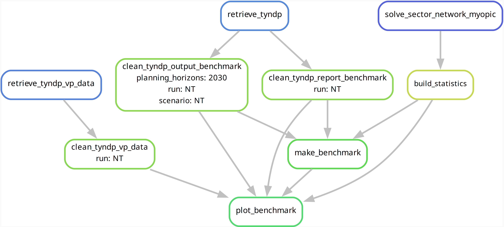
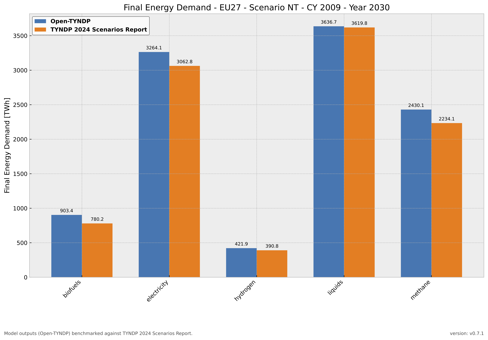
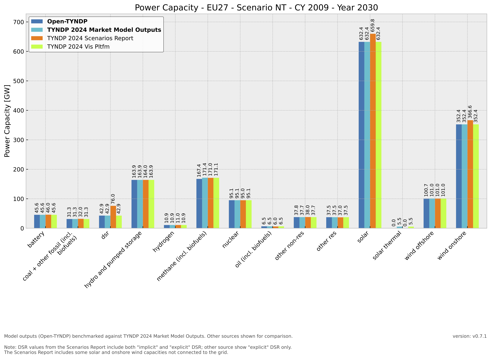
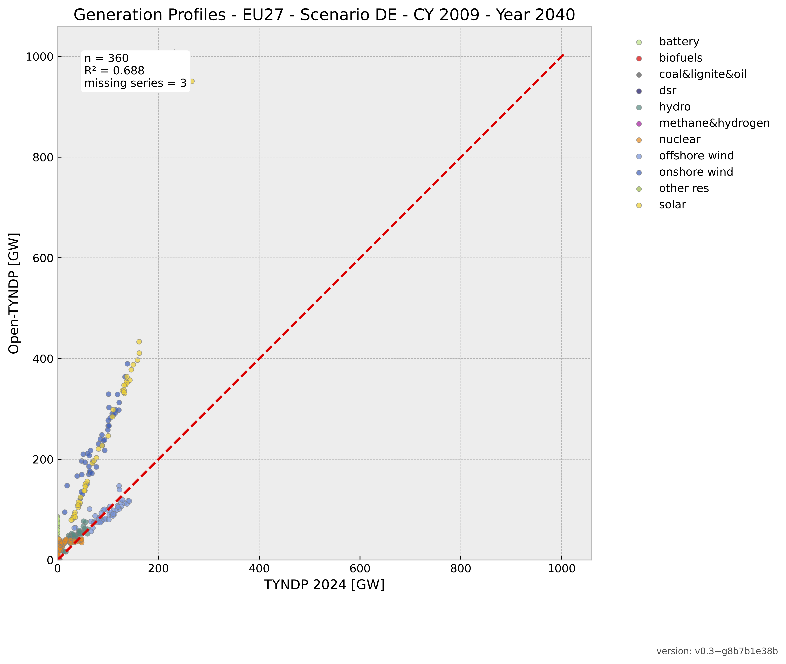
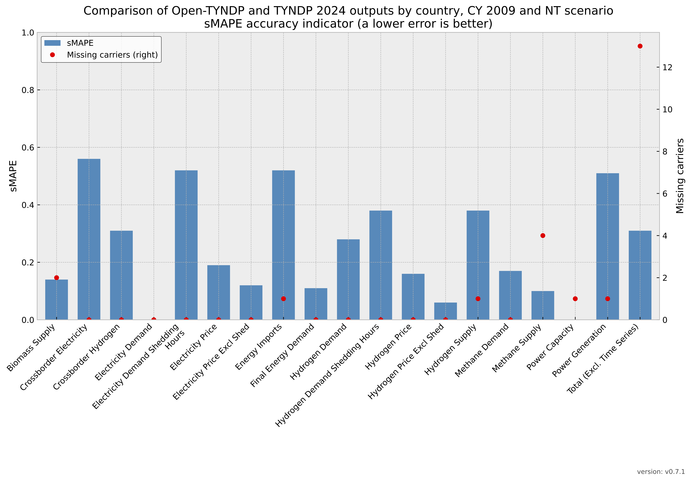

..
  SPDX-FileCopyrightText: Contributors to Open-TYNDP <https://github.com/open-energy-transition/open-tyndp>

  SPDX-License-Identifier: CC-BY-4.0

##########################################
Benchmarking
##########################################

Open-TYNDP includes a structured benchmarking framework for systematic comparison of Open-TYNDP model outputs against TYNDP 2024 scenarios, covering multiple metrics and methods across different levels of aggregation.

Introduction
------------

The following metrics from the `TYNDP 2024 Scenarios Report <https://2024.entsos-tyndp-scenarios.eu/wp-content/uploads/2025/01/TYNDP_2024_Scenarios_Report_FInal_Version_250128_web.pdf>`_ are considered relevant for benchmarking:

* Exogenous Inputs:

  * Final energy demand by fuel, EU27 (TWh), (Fig 5, p24 and Fig 51, p63)
  * Electricity demand per sector, EU27 (TWh), (Fig 6, p25 and Fig 52, p63)
  * Methane demand by sector, EU27 (TWh), (Fig 8, p27 and Fig 53, p64)
  * Hydrogen demand by sector, EU27 (TWh), (Fig 10, p28 and Fig 54, p64)

* Investment and dispatch modelling outputs:

  * Net installed capacity for electricity generation, EU27 (GW), (Fig 25, p39 and Fig 55, p65)
  * Electricity generation, EU27 (TWh), (Fig 26, p39 and Fig 56, p65)
  * Methane supply, EU27 (TWh), (Fig 32, p45 and Fig 57, p66)
  * Hydrogen supply, EU27 (TWh), (Fig 33, p46 and Fig 58, p67)
  * Biomass supply, EU27 (TWh), (Fig 59, p67)
  * Energy imports, EU27 (TWh), (Fig 40, p51 and Fig 60, p68)
  * Hourly generation profile of power generation, (Fig 30, p35)

The data is published in the `Scenarios package <https://2024-data.entsos-tyndp-scenarios.eu/files/reports/TYNDP-2024-Scenarios-Package-20250128.zip>`_. In addition to the TYNDP 2024 Scenarios Report data, data from the `Visualisation Platform <https://2024.entsos-tyndp-scenarios.eu/visualisation-platform/>`_ and the `Market Model Outputs <https://2024.entsos-tyndp-scenarios.eu/download/>`_ are also processed and included in the relevant figures.

The benchmarking is based on the methodology proposed by `Wen et al. (2022) <https://www.sciencedirect.com/science/article/pii/S0306261922011667>`_. This methodology provides a multi-criteria approach to ensure:

- the **diversity** (each indicator has its own added value),
- the **effectiveness** (each indicator provides essential and correct information),
- the **robustness** (against diverse units and orders of magnitude), and
- the **compatibility** (can be used to compare across countries) of the selected set of indicators.

This methodology defines the following indicators:

- **Missing**: Count of carriers / sectors dropped due to missing values
- **sMPE** (Symmetric Mean Percentage Error): Indicates the direction of the deviation between modeled scenarios and TYNDP 2024 outcomes, showing if the output is overall overestimated or underestimated.
- **sMAPE** (Symmetric Mean Absolute Percentage Error): Indicates the absolute magnitude of the deviations, avoiding the cancellation of negative and positive errors.
- **sMdAPE** (Symmetric Median Absolute Percentage Error): Provides skewness information to complement sMAPE.
- **RMSLE** (Root Mean Square Logarithmic Error): Complements the percentage errors since it shows the logarithmic deviation values.
- **Growth error**: Shows the error on the temporal scale. This indicator is ignored for dynamic time series (i.e., hourly generation profiles).

Hourly time series from the TYNDP 2024 are aggregated to match the temporal resolution of Open-TYNDP.

Summary tables are computed for both the overall and per-carrier results. It is possible to benchmark spatially resolved data at bus and country level using the following configurations: `benchmarking.spatial.by_bus` and `benchmarking.spatial.by_country`.

Workflow
--------

The benchmarking workflow is controlled by ``config/benchmarking.default.yaml``.

#. `retrieve_tyndp`: Retrieve the TYNDP 2024 Scenarios Report Data Figures package for benchmarking purposes.
#. `clean_tyndp_report_benchmark`: Read and process the raw TYNDP 2024 Scenarios Report data. The output data structure is a long-format table.
#. `clean_tyndp_vp_data`: Read and process the TYNDP 2024 Visualisation Platform data for benchmarking purposes. The output data structure is a long-format table.
#. `clean_tyndp_output_benchmark`: Read and process the raw TYNDP 2024 Market Model Outputs data. The output data includes crossborder flows, prices, country and EU27 level values.
#. `build_statistics`: Compute the benchmark statistics from the optimised network. Run for every planning horizon. The output data structure is a long-format table.
#. `make_benchmark`: Compute accuracy indicators for comparing model results against reference data from the TYNDP 2024 Scenarios Report, the Visualisation Platform and the Market Model Outputs.
#. `make_benchmarks`: Collect outputs from all `make_benchmark` runs.
#. `plot_benchmark`: Generate visualisation outputs for model benchmarking.
#. `plot_benchmarks`: Collect outputs from all `plot_benchmark` runs.
#. The full set of files produced for the benchmarking are stored in the `results/benchmarks/tyndp-2024/` folder. This includes:

   * `results/benchmarks/tyndp-2024/resources/` for processed inputs information from both Open-TYNDP and TYNDP 2024.
   * `results/benchmarks/tyndp-2024/csvs_s_{clusters}_{opts}_{sector_opts}_all_years/` for quantitative information for each table
   * `results/benchmarks/tyndp-2024/graphics_s_{clusters}_{opts}_{sector_opts}_all_years/` for figures of each table
   * `results/benchmarks/tyndp-2024/kpis_s_{clusters}_{opts}_{sector_opts}_all_years_by_bus.csv` as summary table at bus level
   * `results/benchmarks/tyndp-2024/kpis_s_{clusters}_{opts}_{sector_opts}_all_years_by_country.csv` as summary table at country level
   * `results/benchmarks/tyndp-2024/kpis_s_{clusters}_{opts}_{sector_opts}_all_years_by_bus.pdf` as summary figure at bus level
   * `results/benchmarks/tyndp-2024/kpis_s_{clusters}_{opts}_{sector_opts}_all_years_by_country.pdf` as summary figure at country level
   * the structure of these outputs can be validated in the artifacts of the GitHub CI (e.g. artifacts section `here <https://github.com/open-energy-transition/open-tyndp/actions/runs/17715799690?pr=73>`_)

Outputs
-------

.. warning::
    Open-TYNDP is under active development and is not yet feature-complete. The current `development status <https://open-tyndp.readthedocs.io/en/latest/index.html#development-status>`__ and the general `Limitations <https://open-tyndp.readthedocs.io/en/latest/limitations.html>`__ are important to understand before using the model. The following outputs are presented for illustrative purposes and do not reflect the quality of the results.

Example of indicators extracted from `power_generation_s_all__all_years.csv` by countries for NT scenario with hourly resolution:

========================================  =====  =====  ======  =====  ============  =================  ===============================  =======
Carrier                                   sMPE   sMAPE  sMdAPE  RMSLE  Growth Error  Missing countries  reference                        version
========================================  =====  =====  ======  =====  ============  =================  ===============================  =======
**Coal + other fossil (incl. biofuels)**  0.25   0.82   0.2     8.75   -1.8          0                  TYNDP 2024 Market Model Outputs  v0.6.1
**Hydro (exc. pump storage)**             0.02   0.02   0       0.06   0.02          0                  TYNDP 2024 Market Model Outputs  v0.6.1
**Hydrogen**                              -0.86  1.29   1.66    6.09   -0.11         0                  TYNDP 2024 Market Model Outputs  v0.6.1
**Methane (incl. biofuels)**              -0.33  0.49   0.2     1.25   0.22          0                  TYNDP 2024 Market Model Outputs  v0.6.1
**Nuclear**                               0.08   0.08   0.07    0.09   0             0                  TYNDP 2024 Market Model Outputs  v0.6.1
**Oil (incl. biofuels)**                  0.14   1.49   1.89    10.75  0.24          0                  TYNDP 2024 Market Model Outputs  v0.6.1
**Other non-res**                         -0.25  0.33   0.06    1.13   -0.01         0                  TYNDP 2024 Market Model Outputs  v0.6.1
**Other res**                             0      0      0       0      0             0                  TYNDP 2024 Market Model Outputs  v0.6.1
**Solar**                                 0      0.01   0       0.02   0             0                  TYNDP 2024 Market Model Outputs  v0.6.1
**Wind offshore**                         -0.1   0.11   0       6.23   0.01          0                  TYNDP 2024 Market Model Outputs  v0.6.1
**Wind onshore**                          0      0      0       0      0             0                  TYNDP 2024 Market Model Outputs  v0.6.1
**Demand shedding**                       —      —      —       —      —             0                  TYNDP 2024 Market Model Outputs  v0.6.1
**Solar thermal**                         —      —      —       —      —             0                  TYNDP 2024 Market Model Outputs  v0.6.1
**Slack generator**                       —      —      —       —      —             0                  TYNDP 2024 Market Model Outputs  v0.6.1
========================================  =====  =====  ======  =====  ============  =================  ===============================  =======

Example of figure created for the final energy demand for NT scenario in 2030 with hourly resolution:

Example of figure including Visualisation Platform data created for the power capacity for NT scenario in 2030 with hourly resolution:

Example of figure created for the generation profiles for DE scenario in 2040 with 45SEG:

Example of indicators extracted from `kpis_s_all__all_years_by_country.csv` for NT scenario with hourly resolution:

===========================  =====  =====  ======  =====  ============  ================  =================  ===============================  =======
Metric                       sMPE   sMAPE  sMdAPE  RMSLE  Growth Error  Missing carriers  Missing countries  reference                        version
===========================  =====  =====  ======  =====  ============  ================  =================  ===============================  =======
biomass_supply               0.14   0.14   0.11    0.2    0             2                 0                  TYNDP 2024 Scenarios Report      v0.6.1
elec_demand                  0      0      0       0      0             0                 0                  TYNDP 2024 Scenarios Report      v0.6.1
electricity_price            -0.12  0.2    0.11    0.31   0             0                 0                  TYNDP 2024 Market Model Outputs  v0.6.1
electricity_price_excl_shed  -0.08  0.17   0.1     0.26   0             0                 0                  TYNDP 2024 Market Model Outputs  v0.6.1
energy_imports               0.54   0.54   0.33    1.15   0.01          1                 0                  TYNDP 2024 Scenarios Report      v0.6.1
final_energy_demand          -0.02  0.18   0.09    0.27   0.01          0                 0                  TYNDP 2024 Scenarios Report      v0.6.1
generation_profiles          —      —      —       —      —             NA                NA                 —                                v0.6.1
hydrogen_demand              -0.21  0.32   0       3.08   0             0                 0                  TYNDP 2024 Market Model Outputs  v0.6.1
hydrogen_price               -0.18  0.27   0.03    0.49   0             0                 0                  TYNDP 2024 Market Model Outputs  v0.6.1
hydrogen_price_excl_shed     0.02   0.16   0.02    2.33   0             0                 0                  TYNDP 2024 Market Model Outputs  v0.6.1
hydrogen_supply              -0.2   0.53   0.29    2.26   -0.68         3                 0                  TYNDP 2024 Market Model Outputs  v0.6.1
methane_demand               -0.07  0.18   0.12    0.23   0             0                 0                  TYNDP 2024 Scenarios Report      v0.6.1
methane_supply               0.12   0.12   0.11    0.13   0.01          4                 0                  TYNDP 2024 Scenarios Report      v0.6.1
power_capacity               0      0      0       0.01   0             3                 0                  TYNDP 2024 Market Model Outputs  v0.6.1
power_generation             -0.07  0.27   0       3.82   0.01          3                 0                  TYNDP 2024 Market Model Outputs  v0.6.1
Total (excl. time series)    0.06   0.3    0.02    1.48   0.01          13                —                  —                                v0.6.1
===========================  =====  =====  ======  =====  ============  ================  =================  ===============================  =======

Example of summary figure created for NT scenario:

