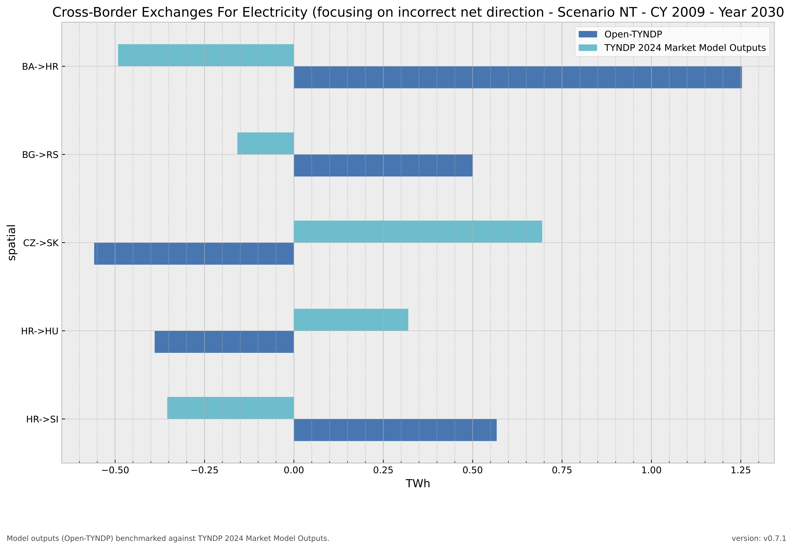

..
  SPDX-FileCopyrightText: Contributors to Open-TYNDP <https://github.com/open-energy-transition/open-tyndp>

  SPDX-License-Identifier: CC-BY-4.0

############
Benchmarking
############

Open-TYNDP includes a structured benchmarking framework that runs automatically with every
workflow execution. It provides systematic, reproducible comparisons of Open-TYNDP model
outcomes against official TYNDP 2024 reference data for both the Scenario Building (SB)
and Cost-Benefit Analysis (CBA) phases.

* **Scenario Building** outcomes are compared against the `TYNDP 2024 Market Model Output
  Files <https://2024.entsos-tyndp-scenarios.eu/download/>`_ and the `TYNDP 2024 Final
  Scenario Report <https://2024.entsos-tyndp-scenarios.eu/wp-content/uploads/2025/01/TYNDP_2024_Scenarios_Report_FInal_Version_250128_web.pdf>`_.
* **Cost-Benefit Analysis** indicators are benchmarked for all calculated indicators and
  all projects against the official `TYNDP 2024 CBA results
  <https://tyndp2024.entsoe.eu/projects-map/transmission>`_.

Benchmarking results are published with every release on `Zenodo
<https://doi.org/10.5281/zenodo.18608105>`_ (currently only Scenario Building results).

.. warning::
    Open-TYNDP is under active development and is not yet feature-complete. The current
    `development status <https://open-tyndp.readthedocs.io/en/latest/index.html#development-status>`__
    and the general `Limitations <https://open-tyndp.readthedocs.io/en/latest/limitations.html>`__
    are important to understand before using the model. The following outputs are presented
    for illustrative purposes and do not reflect the quality of the results.

Benchmarking Methodology
========================

The benchmarking is based on the methodology proposed by `Wen et al. (2022)
<https://www.sciencedirect.com/science/article/pii/S0306261922011667>`_. This methodology
provides a multi-criteria approach to ensure:

- the **diversity** (each indicator has its own added value),
- the **effectiveness** (each indicator provides essential and correct information),
- the **robustness** (against diverse units and orders of magnitude), and
- the **compatibility** (can be used to compare across countries) of the selected set of
  indicators.

This methodology defines the following accuracy indicators:

- **Missing**: Count of carriers / sectors dropped due to missing values.
- **sMPE** (Symmetric Mean Percentage Error): Indicates the direction of the deviation,
  showing if outputs are overall overestimated or underestimated.
- **sMAPE** (Symmetric Mean Absolute Percentage Error): Indicates the absolute magnitude
  of the deviations, avoiding the cancellation of negative and positive errors.
- **sMdAPE** (Symmetric Median Absolute Percentage Error): Provides skewness information
  to complement sMAPE.
- **RMSLE** (Root Mean Square Logarithmic Error): Complements the percentage errors by
  showing logarithmic deviation values.
- **Growth error**: Shows the error on the temporal scale. This indicator is not applied
  to dynamic time series (i.e. hourly generation profiles).

Scenario Building Benchmarking
===============================

Metrics
-------

The following metrics from the `TYNDP 2024 Scenarios Report
<https://2024.entsos-tyndp-scenarios.eu/wp-content/uploads/2025/01/TYNDP_2024_Scenarios_Report_FInal_Version_250128_web.pdf>`_
are considered relevant for Scenario Building benchmarking:

* Exogenous inputs:

  * Final energy demand by fuel, EU27 (TWh), (Fig 5, p24 and Fig 51, p63)
  * Electricity demand per sector, EU27 (TWh), (Fig 6, p25 and Fig 52, p63)
  * Methane demand by sector, EU27 (TWh), (Fig 8, p27 and Fig 53, p64)
  * Hydrogen demand by sector, EU27 (TWh), (Fig 10, p28 and Fig 54, p64)

* Investment and dispatch modelling outputs:

  * Net installed capacity for electricity generation, EU27 (GW), (Fig 25, p39 and Fig 55, p65)
  * Electricity generation, EU27 (TWh), (Fig 26, p39 and Fig 56, p65)
  * Methane supply, EU27 (TWh), (Fig 32, p45 and Fig 57, p66)
  * Hydrogen supply, EU27 (TWh), (Fig 33, p46 and Fig 58, p67)
  * Biomass supply, EU27 (TWh), (Fig 59, p67)
  * Energy imports, EU27 (TWh), (Fig 40, p51 and Fig 60, p68)
  * Hourly generation profile of power generation, (Fig 30, p35)

The data is published in the `Scenarios package
<https://2024-data.entsos-tyndp-scenarios.eu/files/reports/TYNDP-2024-Scenarios-Package-20250128.zip>`_.
In addition to the Scenarios Report data, data from the `Market Model
Outputs <https://2024.entsos-tyndp-scenarios.eu/download/>`_ and the `Visualisation Platform
<https://2024.entsos-tyndp-scenarios.eu/visualisation-platform/>`_ are also processed and
included in the relevant figures.

Hourly time series from TYNDP 2024 are aggregated to match the temporal resolution of
Open-TYNDP. Summary tables are computed for both overall and per-carrier results. Spatially
resolved benchmarking at bus and country level is available via the
``benchmarking.spatial.by_bus`` and ``benchmarking.spatial.by_country`` configuration keys.

Workflow
--------

The SB benchmarking workflow is controlled by ``config/benchmarking.default.yaml``.

#. ``retrieve_tyndp``: Retrieve the TYNDP 2024 Scenarios Report Data Figures package.
#. ``clean_tyndp_report_benchmark``: Read and process the raw Scenarios Report data into
   a long-format table.
#. ``clean_tyndp_vp_data``: Read and process the Visualisation Platform data into a
   long-format table.
#. ``clean_tyndp_output_benchmark``: Read and process the Market Model Outputs, including
   cross-border flows, prices, and country and EU27 level values.
#. ``build_statistics``: Compute benchmarking statistics from the optimised network for
   every planning horizon.
#. ``make_benchmark``: Compute accuracy indicators comparing model outcomes against the
   Market Model Outputs, Scenarios Report, and Visualisation Platform.
#. ``make_benchmarks``: Collect outputs from all ``make_benchmark`` runs.
#. ``plot_benchmark``: Generate visualisation outputs.
#. ``plot_benchmarks``: Collect outputs from all ``plot_benchmark`` runs.

The full set of benchmarking output files is stored under ``results/benchmarks/tyndp-2024/``:

* ``resources/`` — processed benchmarking inputs from both Open-TYNDP and TYNDP 2024.
* ``csvs_s_{clusters}_{opts}_{sector_opts}_all_years/`` — quantitative tables.
* ``graphics_s_{clusters}_{opts}_{sector_opts}_all_years/`` — figures.
* ``kpis_s_{clusters}_{opts}_{sector_opts}_all_years_by_bus.csv`` — summary table aggregated from bus level KPIs.
* ``kpis_s_{clusters}_{opts}_{sector_opts}_all_years_by_country.csv`` — summary table aggregated from country level KPIs.
* ``kpis_s_{clusters}_{opts}_{sector_opts}_all_years_by_bus.pdf`` — summary figure aggregated from bus level KPIs.
* ``kpis_s_{clusters}_{opts}_{sector_opts}_all_years_by_country.pdf`` — summary figure aggregated from country level KPIs.

The structure of these outputs can be validated in the published preliminary benchmarking results on `Zenodo
<https://doi.org/10.5281/zenodo.18608105>`_

.. image:: img/tyndp/benchmarking_workflow.png

Outputs
-------

Example of indicators extracted from ``power_generation_cy2009_s_all___all_years.csv`` by countries
for the NT scenario with hourly resolution:

========================================  =====  =====  ======  =====  ============  =================  ===============================  =======
Carrier                                   sMPE   sMAPE  sMdAPE  RMSLE  Growth Error  Missing countries  reference                        version
========================================  =====  =====  ======  =====  ============  =================  ===============================  =======
**Coal + other fossil (incl. biofuels)**  0.3	 0.76	0.25	8.92   -1.87	     0	                TYNDP 2024 Market Model Outputs	 v0.7.1
**Hydro (exc. pump storage)**             0.01   0.03	0.0	    0.06   0.02	         0	                TYNDP 2024 Market Model Outputs	 v0.7.1
**Hydrogen**                              -0.93  1.19	1.21	6.0    -0.51         1                  TYNDP 2024 Market Model Outputs	 v0.7.1
**Methane (incl. biofuels)**              -0.21  0.34	0.17	0.65   0.16          0                  TYNDP 2024 Market Model Outputs  v0.7.1
**Nuclear**                               0.08   0.08	0.07	0.08   0             0                  TYNDP 2024 Market Model Outputs  v0.7.1
**Oil (incl. biofuels)**                  0.83   1.18	0.95	10.68  0.12          0                  TYNDP 2024 Market Model Outputs	 v0.7.1
**Other non-res**                         -0.23  0.31	0.06	1.16   0             0                  TYNDP 2024 Market Model Outputs	 v0.7.1
**Other res**                             0      0      0       0      0             0                  TYNDP 2024 Market Model Outputs  v0.7.1
**Solar**                                 0      0.01	0       0.02   0             0                  TYNDP 2024 Market Model Outputs  v0.7.1
**Wind offshore**                         -0.1   0.11	0       6.23   0.01          0                  TYNDP 2024 Market Model Outputs  v0.7.1
**Wind onshore**                          0      0      0       0      0             0                  TYNDP 2024 Market Model Outputs  v0.7.1
**Demand shedding**                       1.63   1.8    2.0     13.51  0.03          0                  TYNDP 2024 Market Model Outputs  v0.7.1
**Solar thermal**                         —      —      —       —      —             0                  TYNDP 2024 Market Model Outputs  v0.7.1
========================================  =====  =====  ======  =====  ============  =================  ===============================  =======

Example of figure created for the final energy demand for the NT scenario in 2030 with
hourly resolution:

.. image:: img/tyndp/benchmarking_fed_NT_2030.png

Example of figure including Visualisation Platform data created for the power capacity for
the NT scenario in 2030 with hourly resolution:

.. image:: img/tyndp/benchmarking_power_capacity_NT_2030.png

Example of figure created for the cross-border flows between countries (focusing on incorrect net direction) for the NT scenario in 2030 with
hourly resolution:

Example of figure created for the electricity prices by country for the NT scenario in 2030 with
hourly resolution:

Example of figure created for the generation profiles for the DE scenario in 2040 with 45SEG:

.. image:: img/tyndp/benchmarking_gen_profiles_DE_2040.png

Example of summary indicators extracted from ``kpis_s_all__all_years_by_country.csv`` for the NT
scenario with hourly resolution:

=================================  =====  =====  ======  =====  ============  ================  =================  ===============================  =======
Metric                             sMPE   sMAPE  sMdAPE  RMSLE  Growth Error  Missing carriers  Missing countries  reference                        version
=================================  =====  =====  ======  =====  ============  ================  =================  ===============================  =======
biomass_supply                     0.14   0.14   0.11    0.2    0             2                 0                  TYNDP 2024 Scenarios Report      v0.7.1
crossborder_electricity            -0.03  0.56   0.3     2.29   0             0                 27                 TYNDP 2024 Market Model Outputs  v0.7.1
crossborder_hydrogen               -0.02  0.31   0.13    0.47   0.05          0                 1                  TYNDP 2024 Market Model Outputs  v0.7.1
electricity_demand                 0      0      0       0      0             0                 0                  TYNDP 2024 Market Model Outputs  v0.7.1
electricity_demand_shedding_hours  0.41   0.52   0       6.54	0.21          0                 0                  TYNDP 2024 Market Model Outputs  v0.7.1
electricity_price                  0.11   0.19   0.07    0.3    0.05          0                 0                  TYNDP 2024 Market Model Outputs  v0.7.1
electricity_price_excl_shed        -0.04  0.12   0.07    0.19   -0.02         0                 0                  TYNDP 2024 Market Model Outputs  v0.7.1
energy_imports                     0.52   0.52	 0.3	 1.15	0.01          1                 0                  TYNDP 2024 Scenarios Report      v0.7.1
final_energy_demand                0.11   0.11   0.09	 0.15	0.01          0                 0                  TYNDP 2024 Scenarios Report      v0.7.1
generation_profiles				   —      —      —       —      —             NA                NA                 —                                v0.7.1
hydrogen_demand                    -0.22  0.28   0       2.96   0             0                 1                  TYNDP 2024 Market Model Outputs  v0.7.1
hydrogen_demand_shedding_hours	   0.38   0.38	 0       5.64	0             0                 0                  TYNDP 2024 Market Model Outputs  v0.7.1
hydrogen_price	                   0.11	  0.16	 0.03	 0.27	0             0                 0                  TYNDP 2024 Market Model Outputs  v0.7.1
hydrogen_price_excl_shed	       0.01	  0.06	 0.02	 0.11	0             0                 0                  TYNDP 2024 Market Model Outputs  v0.7.1
hydrogen_supply	                   -0.15  0.38   0.13	 2.05	0.06	      1                 0                  TYNDP 2024 Market Model Outputs  v0.7.1
methane_demand	                   -0.1	  0.17   0.16	 0.21	0             0                 0                  TYNDP 2024 Scenarios Report      v0.7.1
methane_supply	                   0.1    0.1    0.1	 0.1	0             4                 0                  TYNDP 2024 Scenarios Report      v0.7.1
power_capacity	                   0      0      0       0.01   0             1                 0                  TYNDP 2024 Market Model Outputs  v0.7.1
power_generation	               0.28	  0.51   0.05	 6.99	0	          1	                1                  TYNDP 2024 Market Model Outputs  v0.7.1
Total (excl. time series)	       0.14	  0.31   0.03	 1.48	0             13			    —                  —                                v0.7.1
=================================  =====  =====  ======  =====  ============  ================  =================  ===============================  =======

Example of summary figure created for the NT scenario with hourly resolution:

.. image:: img/tyndp/benchmarking_overview_NT.png

Naming conventions
------------

To align naming conventions across data sources, Open-TYNDP uses a mapping table defined in `tyndp_technology_map.csv <https://github.com/open-energy-transition/open-tyndp/blob/master/data/tyndp_technology_map.csv>`_. This table maps the different naming conventions between the Open-TYNDP, various input data sources and benchmarking tables. It contains the following columns:

* **pemmdb_carrier**: Higher level carrier names as listed in the PEMMDB v2.4 dataset.
* **pemmdb_type**: Specific carrier technology type as listed in the PEMMDB v2.4 dataset.
* **pemmdb_hydro_inflows**: Carrier names as listed in the PEMMDB v2.4 hydro inflows dataset.
* **pecd_carrier**: Carrier names as listed in the PECD v3.1 dataset.
* **investment_dataset_carrier**: Carrier names as listed in the TYNDP 2024 investment dataset.
* **tyndp_output_carrier**: Carrier names as listed in the TYNDP 2024 Market Model output files.
* **tyndp_report_carrier**: Carrier names as listed in the TYNDP 2024 Scenarios Report.
* **tyndp_vp_carrier**: Carrier names as listed on the TYNDP 2024 Visualization Platform.
* **open_tyndp_carrier**: Open-TYNDP carrier naming convention representing either an energy carrier or a technology, depending on the context.
* **open_tyndp_index**: Open-TYNDP technology naming convention found in the component index.
* **open_tyndp_nice_names**: Open-TYNDP nice names for better readability and aggregation of technologies for reporting purposes.
* **benchmarking_capacity**: Naming convention for the benchmarking framework's ``power_capacity`` table.
* **benchmarking_generation**: Naming convention for the benchmarking framework's ``power_generation`` table.
* **benchmarking_generation_profiles**: Naming convention for the benchmarking framework's ``generation_profiles`` table.
* **benchmarking_fed**: Naming convention for the benchmarking framework's ``final_energy_demand`` table.
* **benchmarking_elec_demand**: Naming convention for the benchmarking framework's ``electricity_demand`` table.
* **benchmarking_ch4_demand**: Naming convention for the benchmarking framework's ``methane_demand`` table.
* **benchmarking_h2_demand**: Naming convention for the benchmarking framework's ``hydrogen_demand`` table.
* **benchmarking_ch4_supply**: Naming convention for the benchmarking framework's ``methane_supply`` table.
* **benchmarking_h2_supply**: Naming convention for the benchmarking framework's ``hydrogen_supply`` table.
* **benchmarking_biomass_supply**: Naming convention for the benchmarking framework's ``biomass_supply`` table.
* **benchmarking_energy_imports**: Naming convention for the benchmarking framework's ``energy_imports`` table.
* **benchmarking_prices**: Naming convention for the benchmarking framework's different ``price`` tables.
* **benchmarking_shed_hours**: Naming convention for the benchmarking framework's ``electricity_demand_shedding_hours`` and ``hydrogen_demand_shedding_hours`` tables.
* **open_tyndp_type**: Open-TYNDP technology type for grouping together detailed technologies if ``electricity:group_tyndp_conventionals`` is enabled in the configuration.
* **pypsa_eur_carrier**: Corresponding PyPSA-Eur carrier/technology if applicable.
* **comment**: Any additional comments.

Cost-Benefit Analysis Benchmarking
====================================

CBA indicators computed by Open-TYNDP are benchmarked against the official `TYNDP 2024 CBA
results <https://tyndp2024.entsoe.eu/projects-map/transmission>`_ for all calculated
indicators (B1-B4) and all transmission projects. The comparison covers both individual climate year
runs and multi-climate year averages.

Metrics
-------

The following CBA indicators are benchmarked:

* **B1: Social Economic Welfare (SEW):** Quantifies the change in operational system costs (socio-economic welfare).
* **B2: Social costs of CO2 emissions:** Calculates the impact using societal cost assumptions (low, central, high).
* **B3: RES integration costs:** Tracks changes in renewable capacity, generation, and avoided curtailment.
* **B4: Non-direct greenhouse emissions:** Quantifies pollutants (NOx, SO2, PM, etc.) using fuel consumption multipliers.

Per Climate Year
----------------

Indicators are first benchmarked for each individual climate year run (e.g. CY2009, CY2008,
CY1995). This allows deviations to be traced to specific weather conditions and isolates
the effect of inter-annual climate variability on project benefits. For each climate year,
all four indicators (B1–B4) are compared against the TYNDP 2024 reference values for every
transmission project.

Averaged Indicators
-------------------

Following the TYNDP 2024 methodology, indicators are also compared after averaging across
the three climate years. A weighted average is calculated using weights for each climate year provided by the `TYNDP 2024 CBA Implementation Guidelines <https://tyndp.entsoe.eu/resources/tyndp-2024-methodology-cba-implementation-guidelines-for-consultation-1n>`_: 0.233 for 1995, 0.367 for 2008 and 0.4 for 2009.

This averaged comparison is the primary benchmarking target, as it
reflects the same aggregation approach used in the official TYNDP 2024 CBA. Deviations in
the averaged indicators provide the most direct measure of how closely Open-TYNDP reproduces
the official CBA outcomes at the project level.

Workflow
--------

The CBA benchmarking workflow runs automatically after the CBA solve steps and produces
per-indicator, per-project comparison figures and summary tables for both the individual
climate year and averaged results. Output files follow the same structure as the SB
benchmarking and are stored under ``results/[run]/cba/``.
