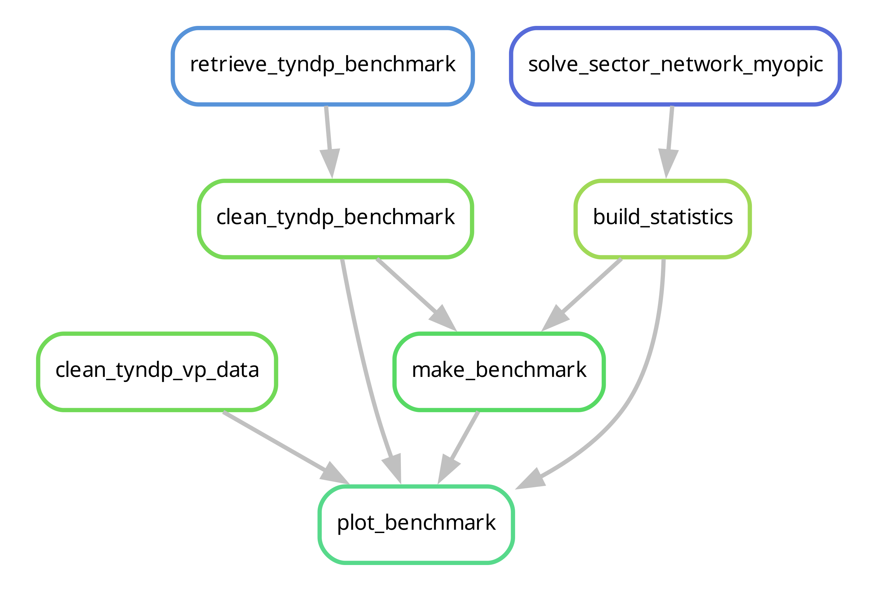
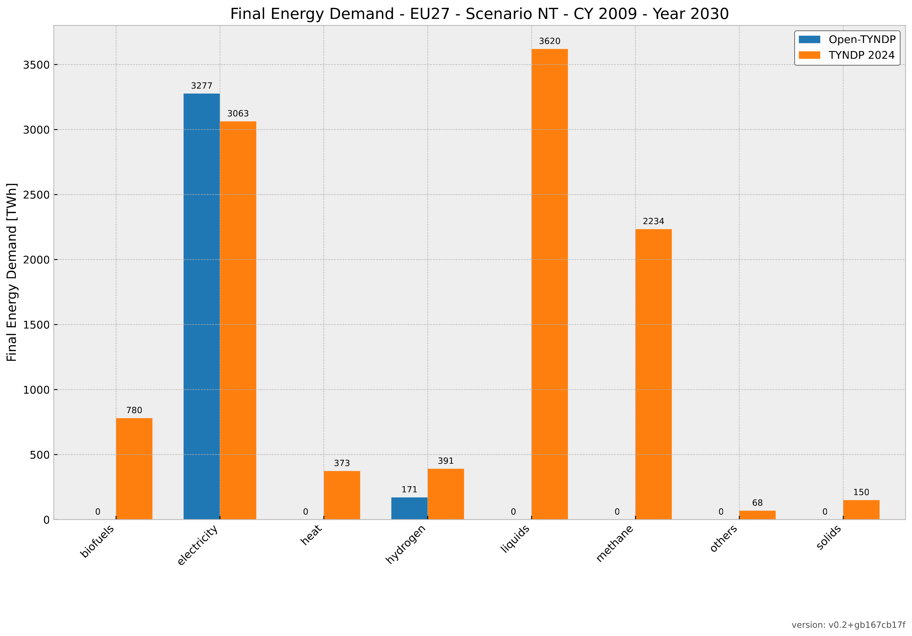
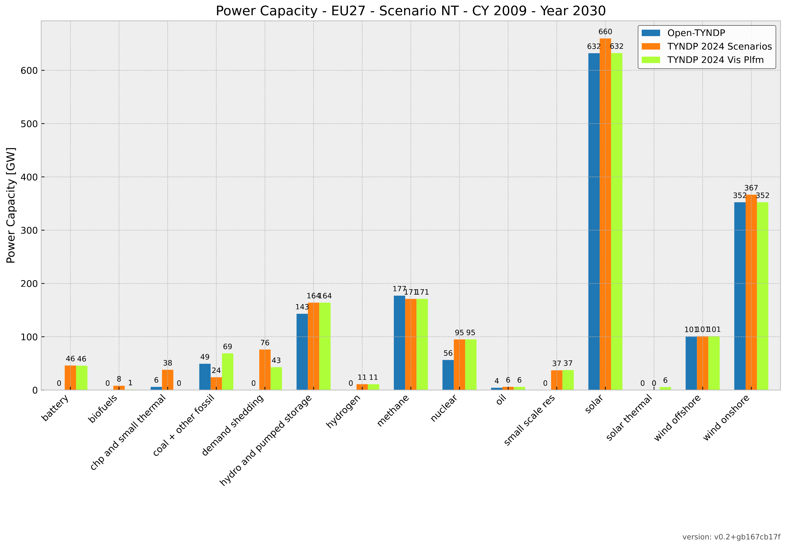
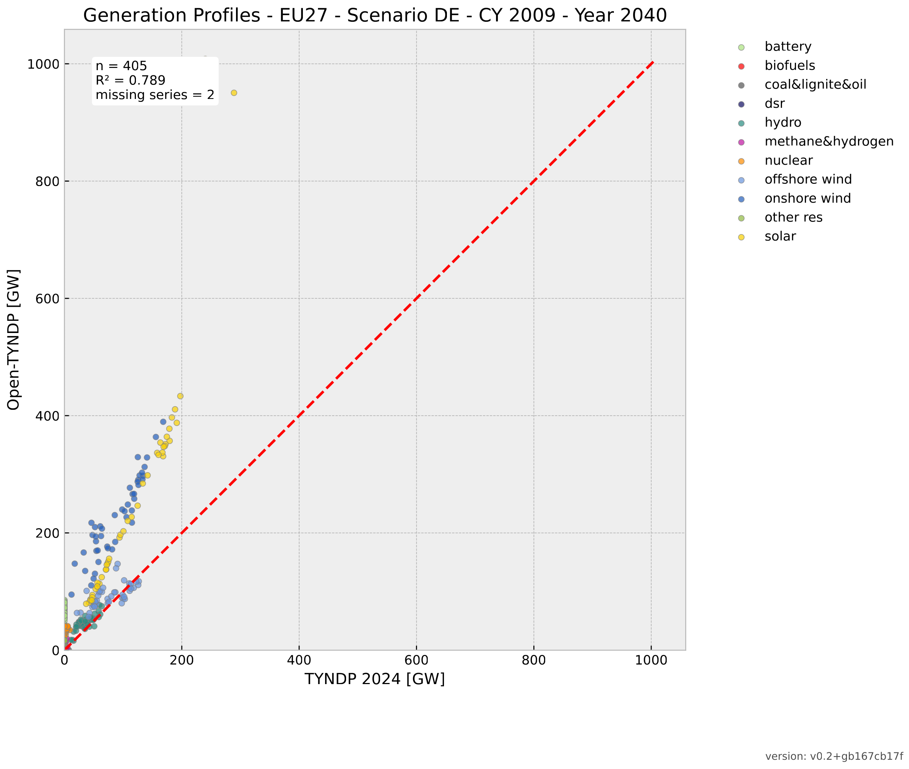
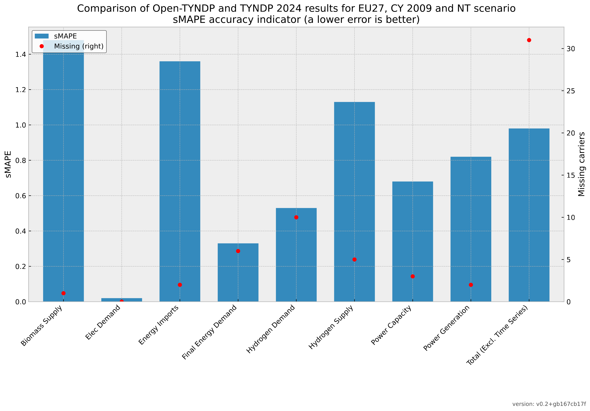

..
  SPDX-FileCopyrightText: Contributors to Open-TYNDP <https://github.com/open-energy-transition/open-tyndp>

  SPDX-License-Identifier: CC-BY-4.0

##########################################
Benchmarking
##########################################

The Open-TYNDP introduces a benchmarking framework for continuous and systematic validation of Open TYNDP model outputs against TYNDP 2024 scenarios. This framework provides flexible and scalable validation across multiple metrics and benchmarking methods.

Introduction
------------

The following metrics from the `TYNDP 2024 Scenarios report <https://2024.entsos-tyndp-scenarios.eu/wp-content/uploads/2025/01/TYNDP_2024_Scenarios_Report_FInal_Version_250128_web.pdf>`_ are considered relevant for benchmarking:

* Exogenous Inputs:

  * Benchmark Final Energy demand by fuel, EU27 (TWh), (Fig 5, p24 and Fig 51, p63)
  * Benchmark Electricity demand per sector, EU27 (TWh), (Fig 6, p25 and Fig 52, p63)
  * Benchmark Methane demand by sector, EU27 (TWh), (Fig 8, p27 and Fig 53, p64)
  * Benchmark Hydrogen demand by sector, EU27 (TWh), (Fig 10, p28 and Fig 54, p64)

* Investment and dispatch modelling outputs:

  * Benchmark of net installed capacity for electricity generation, EU27 (GW), (Fig 25, p39 and Fig 55, p65)
  * Benchmark of electricity generation, EU27 (TWh), (Fig 26, p39 and Fig 56, p65)
  * Benchmark methane supply, EU27 (TWh), (Fig 32, p45 and Fig 57, p66)
  * Benchmark hydrogen supply, EU27 (TWh), (Fig 33, p46 and Fig 58, p67)
  * Benchmark biomass supply, EU27 (TWh), (Fig 59, p67)
  * Benchmark energy imports, EU27 (TWh), (Fig 40, p51 and Fig 60, p68)
  * Hourly generation profile of power generation, Fig 30, p35

The data is published in the `Scenarios package <https://2024-data.entsos-tyndp-scenarios.eu/files/reports/TYNDP-2024-Scenarios-Package-20250128.zip>`_. In addition to the TYNDP 2024 Scenarios Report data, data from the `Visualisation Platform <https://2024.entsos-tyndp-scenarios.eu/visualisation-platform/>`_ is also processed and included in the relevant figures. The Open-TYNDP data is benchmarked against the published TYNDP 2024 Scenarios Report data, while figures present both data sources for comparison purposes. This addition resolves discrepancies observed in the main data source.

The benchmarking is based on the methodology proposed by `Wen et al. (2022) <https://www.sciencedirect.com/science/article/pii/S0306261922011667>`_. This methodology provides a multi-criteria approach to ensure:

- the **diversity** (each indicator has its own added value),
- the **effectiveness** (each indicator provides essential and correct information),
- the **robustness** (against diverse units and orders of magnitude), and
- the **compatibility** (can be used to compare across countries) of the selected set of indicators.

This methodology defines the following indicators:

- **Missing**: Count of carriers / sectors dropped due to missing values
- **sMPE** (Symmetric Mean Percentage Error): Indicates the direction of the deviation between modeled scenarios and TYNDP 2024 outcomes, showing if the output is overall overestimated or underestimated.
- **sMAPE** (Symmetric Mean Absolute Percentage Error): Indicates the absolute magnitude of the deviations, avoiding the cancellation of negative and positive errors.
- **sMdAPE** (Symmetric Median Absolute Percentage Error): Provides skewness information to complement sMAPE.
- **RMSLE** (Root Mean Square Logarithmic Error): Complements the percentage errors since it shows the logarithmic deviation values.
- **Growth error**: Shows the error on the temporal scale. This indicator is ignored for dynamic time series (i.e., hourly generation profiles).

Hourly time series from the TYNDP 2024 will be aggregated to match the temporal resolution of Open-TYNDP.

Summary tables are computed for both the overall and per-carrier results.

Workflow
--------

#. New configuration files `config/benchmarking.default.yaml`.
#. `retrieve_tyndp`: Retrieve the TYNDP 2024 Scenarios Report Data Figures package for benchmarking purposes.
#. (new) `clean_tyndp_benchmark`: Read and process the raw TYNDP 2024 Scenarios Report data. The output data structure is a long-format table.
#. (new) `clean_tyndp_vp_data`: Read and process the TYNDP 2024 Visualisation Platform data for benchmarking purposes. The output data structure is a long-format table.
#. (new) `build_statistics`: Compute the benchmark statistics from the optimised network. Run for every planning horizon. The output data structure is a long-format table.
#. (new) `make_benchmark`: Compute accuracy indicators for comparing model results against reference data from TYNDP 2024 Scenarios Report data.
#. (new) `make_benchmarks` to collect `make_benchmark` outputs
#. (new) `plot_benchmark`: Generate visualisation outputs for model validation.
#. (new) `plot_benchmarks` to collect `plot_benchmarks` outputs
#. The full set of files produced for the benchmarking are stored in the `results/validation/` folder. This includes:

   * `results/validation/resources/` for processed inputs information from both Open-TYNDP and TYNDP 2024.
   * `results/validation/csvs_s_{clusters}_{opts}_{sector_opts}_all_years/` for quantitative information for each table
   * `results/validation/graphics_s_{clusters}_{opts}_{sector_opts}_all_years/` for figures of each table
   * `results/validation/kpis_eu27_s_{clusters}_{opts}_{sector_opts}_all_years.csv` as summary table
   * `results/validation/kpis_eu27_s_{clusters}_{opts}_{sector_opts}_all_years.pdf` as summary figure
   * the structure of these outputs can be validated in the artifacts of the GitHub CI (e.g. artifacts section `here <https://github.com/open-energy-transition/open-tyndp/actions/runs/17715799690?pr=73>`_)

Outputs
-------

.. warning::
    Open-TYNDP is under active development and is not yet feature-complete. The current `development status <https://open-tyndp.readthedocs.io/en/latest/index.html#development-status>`__ and the general `Limitations <https://open-tyndp.readthedocs.io/en/latest/limitations.html>`__ are important to understand before using the model. The following outputs are presented for illustrative purposes and do not reflect the quality of the results.

Example of indicators extracted from `power_generation_s_all__all_years.csv` for NT scenario with hourly resolution:

================================  =======  =======  ========  =======  ================  ====================
Carrier                           sMPE     sMAPE    sMdAPE    RMSLE    Growth Error      version
================================  =======  =======  ========  =======  ================  ====================
**Coal + other fossil**           0.8      0.8      0.8       1.04     -0.1              v0.4.2+g2ea5c25b7
**Hydro (exc. pump storage)**     -0.05    0.05     0.05      0.05     0                 v0.4.2+g2ea5c25b7
**Hydrogen**                      0.11     0.2      0.2       0.23     -0.04             v0.4.2+g2ea5c25b7
**Methane**                       0        0.03     0.03      0.03     -0.01             v0.4.2+g2ea5c25b7
**Nuclear**                       0.07     0.07     0.07      0.08     -0.01             v0.4.2+g2ea5c25b7
**Oil**                           -0.5     0.5      0.5       0.65     -0.08             v0.4.2+g2ea5c25b7
**Solar**                         -0.09    0.09     0.09      0.09     0                 v0.4.2+g2ea5c25b7
**Wind offshore**                 -0.18    0.18     0.18      0.18     -0.01             v0.4.2+g2ea5c25b7
**Wind onshore**                  -0.09    0.09     0.09      0.1      -0.01             v0.4.2+g2ea5c25b7
**Other non-res**                 —        —        —         —        —                 v0.4.2+g2ea5c25b7
**Other res**                     —        —        —         —        —                 v0.4.2+g2ea5c25b7
**Biofuels**                      —        —        —         —        —                 v0.4.2+g2ea5c25b7
**OCGT**                          —        —        —         —        —                 v0.4.2+g2ea5c25b7
================================  =======  =======  ========  =======  ================  ====================

Example of figure created for the final energy demand for NT scenario in 2030 with hourly resolution:

Example of figure including Visualisation Platform data created for the power capacity for NT scenario in 2030 with hourly resolution:

Example of figure created for the generation profiles for DE scenario in 2040 with 45SEG:

Example of indicators extracted from `kpis_eu27_s_all__all_years.csv` for NT scenario with hourly resolution:

===========================  =======  =======  ========  =======  ================  =========  ====================
Metric                       sMPE     sMAPE    sMdAPE    RMSLE    Growth Error      Missing    version
===========================  =======  =======  ========  =======  ================  =========  ====================
biomass_supply               0.11     0.11     0.06      0.16     0                 1          v0.4.2+g2ea5c25b7
elec_demand                  0        0        0         0        0                 0          v0.4.2+g2ea5c25b7
energy_imports               0.46     0.46     0.34      0.75     0.01              1          v0.4.2+g2ea5c25b7
final_energy_demand          0.07     0.09     0.08      0.13     0.01              1          v0.4.2+g2ea5c25b7
generation_profiles          —        —        —         —        —                 NA         v0.4.2+g2ea5c25b7
hydrogen_demand              -0.07    0.13     0.1       0.16     -0.01             1          v0.4.2+g2ea5c25b7
hydrogen_supply              -0.06    0.56     0.54      0.76     -0.02             2          v0.4.2+g2ea5c25b7
methane_demand               0.17     0.23     0.15      0.31     0                 0          v0.4.2+g2ea5c25b7
methane_supply               0.21     0.21     0.16      0.24     0.01              4          v0.4.2+g2ea5c25b7
power_capacity               0.02     0.09     0.02      0.16     -0.01             5          v0.4.2+g2ea5c25b7
power_generation             0.01     0.22     0.1       0.42     -0.01             4          v0.4.2+g2ea5c25b7
Total (excl. time series)    0.12     0.31     0.14      0.55     0                 16         v0.4.2+g2ea5c25b7
===========================  =======  =======  ========  =======  ================  =========  ====================

Example of summary figure created for NT scenario:

