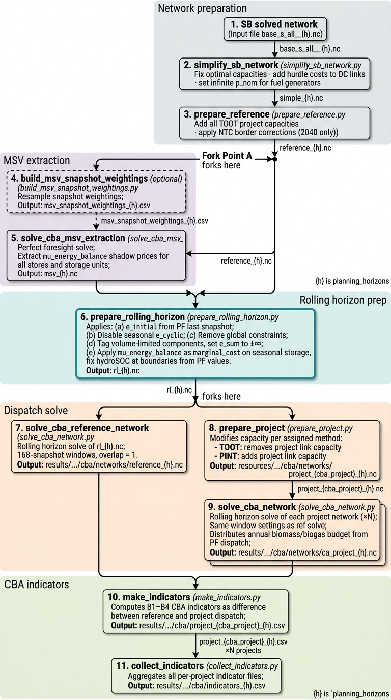

.. SPDX-FileCopyrightText: Contributors to Open-TYNDP <https://github.com/open-energy-transition/open-tyndp>
..
.. SPDX-License-Identifier: CC-BY-4.0

.. _cba-workflow:

####################################
Cost-Benefit Analysis (CBA) Workflow
####################################

This section describes the methodology and workflow used for the Cost-Benefit Analysis (CBA) in the Open-TYNDP. 
We run the simulation in weekly windows (a rolling horizon). Because the model processes the year in one-week increments, it uses Marginal Storage Values (MSV), 
derived from a full-year optimization, to guide the use of long-term resources. 
This ensures that seasonal assets like hydro reservoirs, biomass, and hydrogen storage are used efficiently across the entire year, rather than being exhausted too quickly.

Overview
========

The CBA workflow evaluates transmission projects by comparing two dispatch simulations:
a **reference network** (the grid with all relevant projects included) and a **project
network** (the grid with the evaluated project either removed via TOOT or added via PINT).
Both networks are solved using a **rolling horizon** approach: the full year is divided
into sequential weekly windows (168 hourly snapshots each, with an overlap of 1 snapshot),
which are solved one after another.

However, a naive rolling horizon introduces **myopia** for seasonal storage components (H2 stores,
gas stores, large hydro reservoirs): the optimizer cannot see beyond the current week and
therefore makes suboptimal dispatch decisions. The MSV preparation step described below
resolves this.

The full pipeline is illustrated below:

.. note::
    The diagram above shows the complete sequence of Snakemake rules and intermediate
    files. Dashed borders indicate optional steps; the ``×N`` annotation on
    ``solve_cba_network`` indicates it runs once per evaluated project.

TOOT and PINT
=============

Within the CBA, there are two methods to evaluate the cost-benefit impact of a project: 

- **TOOT (Take Out One at a Time)**: evaluates the impact of removing a project from the reference network
- **PINT (Put IN at a Time)**: evaluates the impact of adding a project to the reference network

Pipeline Stages
===============

Stage 0 — Network Simplification (``simplify_sb_network``)
-----------------------------------------------------------

The solved Scenario Building (SB) network ``base_s_all___{h}.nc`` is transformed into
a dispatch-ready CBA network:

- **Capacities are fixed** via ``n.optimize.fix_optimal_capacities()``. The CBA
  optimizes dispatch only; no new investment is allowed.
- **Hurdle costs** of 0.01 €/MWh are applied to all DC links (per TYNDP 2024 CBA
  Implementation Guidelines, p. 20).
- **Primary fuel generator capacities** (coal, gas, oil, nuclear, etc.) 
In the Open-TYNDP, primary fuels are modeled using PyPSA Generator components that represent the fuel supply rather than physical power plants. While the Scenario Building phase determines a peak hourly fuel consumption capacity, these capacities are set to infinity during the CBA workflow. This ensures that the simulation is not artificially restricted by fuel supply limits during peak hours, allowing for a more flexible dispatch

Output: ``resources/cba/networks/simple_{h}.nc``

Stage 1 — Reference Network (``prepare_reference``)
----------------------------------------------------

The simplified network is extended to form the CBA reference baseline:

- **All TOOT project capacities are added** to the network. The reference always
  includes all evaluated projects, regardless of the method (TOOT or PINT) used
  for each individual project.
- **NTC border corrections** are applied for the 2040 planning horizon to align
  border capacities with CBA guidelines (issue `#406
  <https://github.com/open-energy-transition/open-tyndp/issues/406>`__).

This shared reference is the input for both the MSV extraction path and directly
into the rolling horizon preparation, ensuring both steps operate on the same topology.

Output: ``resources/cba/networks/reference_{h}.nc``

.. note::
    At this point the pipeline **forks**. The reference network feeds two parallel
    paths: the MSV extraction path (Stages 2a–2b) and directly into Stage 3.

Stage 2a — Snapshot Weightings (``build_msv_snapshot_weightings``) *(optional)*
---------------------------------------------------------------------------------

To reduce solving time for the perfect foresight optimization, the workflow allows for temporal aggregation during the MSV extraction process.

When ``cba.msv_extraction.resolution`` is set to a coarser hourly resolution (e.g., ``24H``), the native snapshot weightings are resampled to decrease the computational burden of the Stage 2b solve. This rule generates the resampled weightings CSV from the reference network's snapshot index and feeds it directly into the optimization. If no temporal aggregation is configured (``resolution: false``), this step is skipped entirely and Stage 2b uses the network's native resolution.

Output: ``resources/cba/msv_snapshot_weightings_{h}.csv``

Stage 2b — MSV Extraction (``solve_cba_msv_extraction``)
---------------------------------------------------------

The reference network is solved with **perfect foresight** (entire year, single LP)
with ``assign_all_duals=True``. This exposes the LP dual variables of the energy
balance constraints for all stores and storage units as ``mu_energy_balance``.

These shadow prices are the **Marginal Storage Values (MSV)**: they represent the
opportunity cost of stored energy at each timestep — what it is worth to the system
to have one additional MWh in storage at that moment. MSV is high before a scarcity
period and low when storage is plentiful.

The optional temporal aggregation (e.g. ``"24H"``) reduces the size of this full-year
LP, making extraction faster at the cost of MSV resolution. The resulting shadow prices
are later resampled back to the target dispatch resolution.

Output: ``resources/cba/networks/msv_{h}.nc`` (solved network carrying ``mu_energy_balance``)

.. note::
    At this point the MSV path **rejoins** the spine. Both ``msv_{h}.nc`` and
    ``reference_{h}.nc`` are inputs to Stage 3.

Stage 3 — Rolling Horizon Preparation (``prepare_rolling_horizon``)
---------------------------------------------------------------------

This is the central preparation step. It takes the reference network and the MSV
network and applies five transformations **in order**:

**(a) Set initial storage state from perfect foresight**

For all stores and storage units that are not in ``cyclic_carriers`` (i.e. seasonal
components) and were originally cyclic, ``e_initial`` / ``state_of_charge_initial``
is set to the perfect foresight solution's last-snapshot value. This must happen *before* disabling
cyclicity so the original cyclic flags are still readable.

**(b) Disable cyclicity for seasonal storage**

Carriers listed in ``cba.storage.cyclic_carriers`` (currently ``battery`` and
``home battery``) keep ``e_cyclic=True`` / ``cyclic_state_of_charge=True``. These
are short-term storage components that cycle within each weekly window independently.

All other stores and storage units (H2 Store, gas, co2 sequestered, hydro, PHS, etc.)
have cyclicity disabled. Their dispatch is instead guided by the MSV applied in (e).

**(c) Remove annual global constraints**

The ``co2_sequestration_limit`` and ``unsustainable biomass limit`` global constraints
are removed. These constraints are instead enforced by CO2 price and dispatch 
of the biomass and biogas generators.

**(d) Disable annual volume limits**

Components with finite ``e_sum_min`` / ``e_sum_max`` (biomass generators, biogas links)
are tagged with ``has_volume_limit=1`` and their limits are set to ±∞. The per-window
energy budget is distributed dynamically during the rolling horizon solve based on the
PF dispatch, proportionally allocating the annual constraint to each window.

**(e) Apply MSV as marginal cost**

For all stores and storage units with carriers **not** in ``cyclic_carriers``, the
``mu_energy_balance`` time series from the MSV network is written into ``marginal_cost``
(time-varying). This makes the optimizer value stored energy according to its future
shadow price even within a 7-day window, approximating the full-year PF decision.

If the MSV extraction resolution differs from the target dispatch resolution (e.g.
24H extracted, 3H dispatch), the MSV is resampled using
``cba.msv_extraction.resample_method`` (``"ffill"`` by default, or ``"interpolate"``).

**Fix hydro-reservoir SOC at window boundaries**

Large hydro reservoirs require special treatment. Their LP duals (``mu_energy_balance``)
tend to be near-zero due to complementary slackness — the reservoir is rarely exactly
at its bounds, so the constraint is inactive and the dual is zero. MSV alone is therefore
insufficient to guide hydro dispatch.

Carriers listed in ``cba.storage.soc_boundary_carriers`` (currently ``hydro-reservoir``)
receive an additional constraint: ``state_of_charge_set`` is populated with the PF
solution's values at the **first and last snapshot of each rolling horizon window**, and
with NaN elsewhere. This pins the reservoir trajectory at window boundaries while giving
the optimizer full freedom for intra-window dispatch.

Output: ``resources/cba/networks/rl_{h}.nc``

.. note::
    At this point the pipeline **forks again**. ``rl_{h}.nc`` feeds both the reference
    solve (Stage 4) and the project preparation path (Stages 5a–5b).

Stage 4 — Reference Solve (``solve_cba_reference_network``)
------------------------------------------------------------

The prepared rolling horizon network is solved as-is (no project modification).
This is the baseline against which all project networks are compared.

At each window boundary, ``e_initial`` and ``state_of_charge_initial`` are updated
from the previous window's solution to carry storage state forward through the year.

Output: ``results/{run}/cba/networks/reference_{h}.nc``

Stage 5a — Project Preparation (``prepare_project``)
-----------------------------------------------------

For each evaluated project, the rolling horizon network ``rl_{h}.nc`` is modified
per the assigned method:

- **Take Out One at the Time (TOOT)**: removes the project's link capacity from the reference network. Behaviour
  when removal would produce negative capacity is controlled by
  ``cba.negative_toot_capacity`` (``"zero"`` clamps to zero; ``"break"`` raises an error).
- **Put IN one at the Time (PINT)**: adds the project's link capacity. New links are created with
  ``capital_cost`` computed from length, underwater fraction, and technology costs.

Output: ``resources/cba/networks/project_{cba_project}_{h}.nc``

Stage 5b — Project Solve (``solve_cba_network``)
-------------------------------------------------

Each project network is solved with the same rolling horizon settings as the reference.
This rule runs once **per evaluated project**. Additionally, at each window the
per-window energy budget for volume-limited components (biomass, biogas) is set from
the perfect foresight dispatch stored in ``generators_t.p`` / ``links_t.p0``.

A fallback solver can be configured via ``cba.solving.fallback_solver`` in case the
primary solver fails on a specific window.

.. note::
    ``solve_cba_network`` depends **exclusively** on the output of ``prepare_project``
    (Stage 5a). It has no direct connection to the rolling horizon preparation network
    ``rl_{h}.nc`` or any earlier stage.

Output: ``results/tyndp/{run}/cba/networks/project_{cba_project}_{h}.nc``

Stage 6 — Indicators (``make_indicators`` → ``collect_indicators``)
--------------------------------------------------------------------

B1–B4 CBA indicators are computed as the difference in system costs and emissions
between the reference and project dispatch solutions. Both the reference result
(Stage 4) and the project result (Stage 5b) are inputs to this step. Results are
collected across all projects into a summary CSV.

Outputs:

- ``results/tyndp/{run}/cba/project_{cba_project}_{h}.csv`` (per project)
- ``results/tyndp/{run}/cba/indicators_{h}.csv`` (all projects)

Configuration Reference
=======================

The rolling horizon dispatch is controlled by the ``cba`` section of the configuration
file. For information on the configuration options for the rolling horizon as well as other settings, 
including project selection and scenario setup, see :doc:`cba`.

Key Assumptions and Design Decisions
=====================================

**Why pin hydro SOC at window boundaries?**

For large hydro reservoirs, the LP dual of the energy balance is nearly flat due to
complementary slackness: the reservoir rarely sits exactly at a bound, so the
constraint is inactive and the dual is zero. MSV alone cannot guide hydro dispatch.
Pinning the first and last snapshot of each window from the PF solution constrains
the trajectory endpoints while preserving intra-window freedom. See also issue
`#376 <https://github.com/open-energy-transition/open-tyndp/issues/376>`__.

**Why distribute biomass/biogas budgets per window from PF?**

Annual ``e_sum_min`` / ``e_sum_max`` constraints cannot be split evenly across windows
because the seasonal dispatch pattern of these resources is uneven. Distributing the
budget proportionally to the PF dispatch preserves the intended annual constraint in
expectation without requiring the rolling horizon to know the full annual total.

**Why are fuel generator capacities set to infinity?**

With capacities fixed at SB values and a weekly horizon, peak fuel supply can become
artificially constrained mid-window even though the annual SB solution had sufficient
supply. Since these generators have no capital costs, removing the capacity ceiling
does not affect the cost-optimal dispatch — it only prevents spurious infeasibilities.
