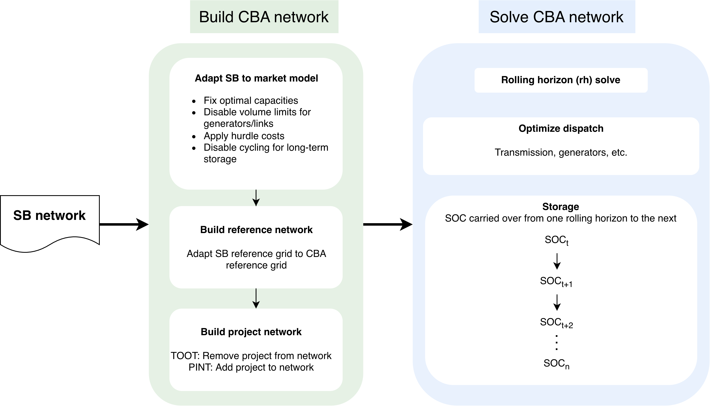

.. SPDX-FileCopyrightText: Contributors to Open-TYNDP <https://github.com/open-energy-transition/open-tyndp>
..
.. SPDX-License-Identifier: CC-BY-4.0

###########################
Cost-Benefit Analysis (CBA)
###########################

CBA Workflow
============

At the high-level, the Scenario Building (SB) builds and solves the base network(s) for each scenario/planning horizon, optimizing investments and dispatch.
The CBA does not re‑optimize capacities -- it reuses the SB’s solved network as a starting point, makes modifications (such as fixing capacities), 
and then runs dispatch-only optimizations on the prepared networks.

A diagram of the workflow between SB and CBA is shown below:

The CBA workflow is described in detail in the ``doc/cba-rolling-horizon.rst`` document.

Calculate CBA Indicators
========================

After solving both the reference and project networks, several key indicators are
calculated to assess benefits of each project and to determine whether the project
provides a positive net benefit to the energy system. The indicators calculated in the
CBA are described in additional detail in the ``doc/cba-indicators.rst`` document.
The calculations of the CBA indicators are implemented in the
``scripts/cba/make_indicators.py`` script.

The calculated CBA indicators for each project are saved in:

- ``results/cba/{cba_method}/project_{cba_project}_{planning_horizons}.csv`` for individual
  project indicators
- ``results/cba/{cba_method}/indicators_{planning_horizons}.csv`` for the collected
  indicators across all projects in a run

Configuration
=============

The CBA workflow is configured in the top-level ``cba`` section of the configuration
file. This documentation section describes how the settings affect the workflow.

Project selection and scope
---------------------------

The following settings define which CBA projects (transmission, storage) are evaluated, 
for which planning horizons, and which methodology (TOOT, PINT) is applied:

.. code-block:: yaml

    cba:
      planning_horizons:
      - 2030
      - 2040
      projects:
      - t1-t35
      area: tyndp

- ``cba.planning_horizons``: selects the planning horizons for the CBA workflow.
  These are typically a subset of the main scenario planning horizons.
- ``cba.projects``: defines which project identifiers are included in the assessment. 
  One can use this setting to select a single project (e.g., ``t1``), 
  subset of projects (e.g., ``t1-t35``, which would evaluate all projects with IDs from t1 to t35), 
  or all projects (leave empty for all) for evaluation.
- ``cba.area``: controls which geographic area is used for the calculation of the indicators 
  The default is ``tyndp``.

Scenario Building input into CBA
--------------------------------

The CBA workflow can either reuse SB networks created in the same workflow run or
pull pre-solved SB networks (thereby not requiring the entire SB workflow to be run) from an external archive:

.. code-block:: yaml

    cba:
      cba_scenario_input:
        use_presolved: false
        sb_version: latest

- ``cba.cba_scenario_input.use_presolved``: If ``false``, the CBA depends on SB
  outputs created by the workflow. If ``true``, the workflow retrieves pre-solved 
  SB networks instead.
- ``cba.cba_scenario_input.sb_version``: selects which pre-solved SB archive version
  is used. Default is ``latest``, which retrieves the latest available version.

Indicator assumptions
---------------------

There are also CBA settings for assumptions used in the calculation of the CBA indicators.

.. code-block:: yaml

    cba:
      hurdle_costs: 0.01
      co2_societal_cost:
        2030:
          low: 126
          central: 238
          high: 315
        2040:
          low: 339
          central: 628
          high: 662
      remove_noisy_costs: true
      negative_toot_capacity: zero

- ``cba.hurdle_costs``: applies a small marginal cost to transmission links in the CBA
  networks. The default value is 0.01 EUR/MWh.
- ``cba.co2_societal_cost``: provides the CO2 societal cost assumptions in 2030 and 2040,
  for the low, central, and high scenarios. These values are used in the calculation of the CO2 societal cost indicator.
  The default values are from the CBA Implementation Guide.
- ``cba.remove_noisy_costs``: If ``true``, removes noisy costs that were added 
  during the network solves to some components in the network for the calculation 
  of the CBA B1 indicator. This is only a post-processing step. The default is ``true``.
- ``cba.negative_toot_capacity``: defines how TOOT project removal is handled if the
  removed capacity would make the remaining project capacity negative. This is only for fringe cases where the reference grid capacity 
  leads to negative project capacity after removal. For almost all projects this is not needed. 

Rolling horizon dispatch
------------------------

The settings for the rolling horizon dispatch can be defined in the following sections of the configuration file.:

.. code-block:: yaml

    cba:
      storage:
        cyclic_carriers:
        - battery
        - home battery
        soc_boundary_carriers:
        - hydro-reservoir
      msv_extraction:
        resolution: false
        resample_method: ffill
      solving:
        options:
          horizon: 168
          overlap: 1
        solver:
          name: highs
          options: highs-simplex

- ``cba.storage.cyclic_carriers``: lists which storage carriers remain cyclic within
  each rolling horizon window. All other store and storage unit carriers automatically 
  receive marginal storage value and have cyclicity disabled.
- ``cba.storage.soc_boundary_carriers``: lists storage unit carriers for which the state of charge 
  is pinned at the boundaries between rolling horizon windows, using values pre-computed from the 
  perfect foresight (full-year) optimisation.
- ``cba.msv_extraction.resolution``: controls temporal resolution for the MSV extraction solve. 
  If `false`, it uses the same temporal resolution as defined in ``clustering.resolution_sector``. 
  Otherwise, one could also provide a string like '24H', '48H' for a different temporal resolution.
- ``cba.msv_extraction.resample_method``: method for resampling marginal storage value to target network resolution. 
  The default is 'ffill' (forward fill), which holds the MSV constant within each cluster. 
  Another option is 'interpolate', which linearly interpolates the MSV between cluster centers.
- ``cba.solving.options.horizon`` and ``cba.solving.options.overlap``: define the
  rolling horizon window length and overlap.
- ``cba.solving.solver`` and ``cba.solving.solver_options``: configure the solver and solver settings 
  used for the CBA solves.

For the detailed information about the design of the rolling horizon methodology itself, including MSV extraction,
seasonal storage handling, and window-boundary SOC treatment, see
:doc:`cba-rolling-horizon`.

Running single vs multiple climate years
========================================

In the current release, we have implemented the ability to run multiple climate (or weather) years in the CBA workflow. 
This allows for a more robust assessment of project benefits across climate years, which is consistent with the CBA implementation.

On the current implementation, the CBA entry point ``snakemake -call cba`` expects a
**collection scenario** that defines a list of child (climate years) scenarios. 
In practice, the run selected in ``run.name`` must itself define a list under ``cba.scenarios`` in the scenario file.

This is the pattern used in ``config/scenarios.tyndp.yaml``:

.. code-block:: yaml

    NT-cyears:
      cba:
        scenarios: [NT-cy2009, NT-cy2008, NT-cy1995]

The individual climate-year scenarios should contain the weather-year-specific
``snapshots`` and ``atlite.default_cutout`` settings. 
It should also define a ``cba.sb_scenario`` setting to specify which SB scenario is used as the input for the CBA workflow.
Note that any ``cba.sb_scenario`` defined here should also be defined in the scenario file with the same name (e.g., ``NT`` in this example) 
and should contain the SB settings for the scenario, such as the planning horizon, cluster settings, etc.

.. code-block:: yaml

    NT-cy2009:
      snapshots:
        start: "2009-01-01"
        end: "2010-01-01"

      atlite:
        default_cutout: europe-2009-sarah3-era5

      cba:
        sb_scenario: NT

Running multiple climate years
------------------------------

For climate-year collections, the repository already contains ready-to-use scenarios
such as ``NT-cyears``, ``DE-cyears`` and ``GA-cyears``.

For example, to run the `NT`` climate-year CBA scenarios, 
modify the `run.name` in ``config/config.tyndp.yaml`` to ``NT-cyears`` and then run:

.. code-block:: console

    $ snakemake -call cba --configfile config/config.tyndp.yaml

This uses the ``NT-cyears`` entry from ``config/scenarios.tyndp.yaml``, which expands
to the child scenarios ``NT-cy2009``, ``NT-cy2008`` and ``NT-cy1995``.

Running a single climate year on this branch
--------------------------------------------

Running a plain scenario such as ``NT-cy2009`` directly with
``snakemake -call cba`` is not sufficient. The CBA pseudo-rule collects only runs that
themselves define ``cba.scenarios``. Therefore, the current workaround for a
single-climate-year CBA is to create a **one-entry collection scenario** and run that
wrapper scenario instead.

For example, add the following entry to your scenario file:

.. code-block:: yaml

    NT-cy2009-only:
      cba:
        scenarios: [NT-cy2009]

Then, change the ``run.name`` in ``config/config.tyndp.yaml`` to ``NT-cy2009-only`` and run:

.. code-block:: console

    $ snakemake -call cba --configfile config/config.tyndp.yaml
