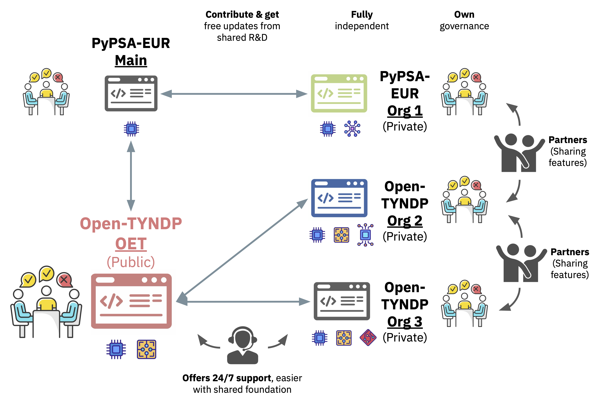
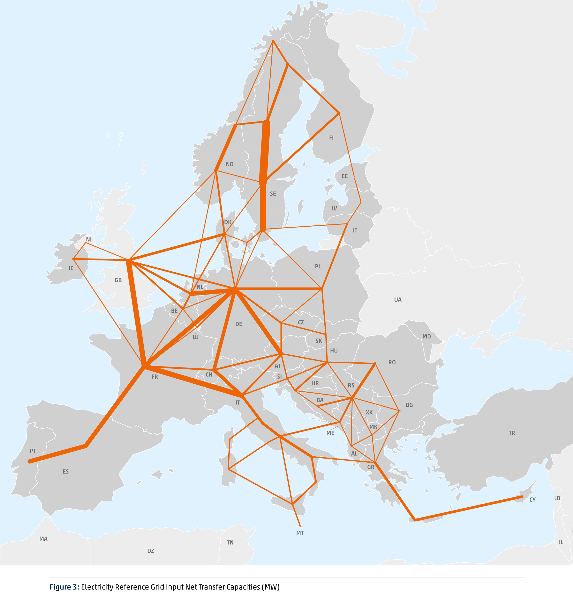
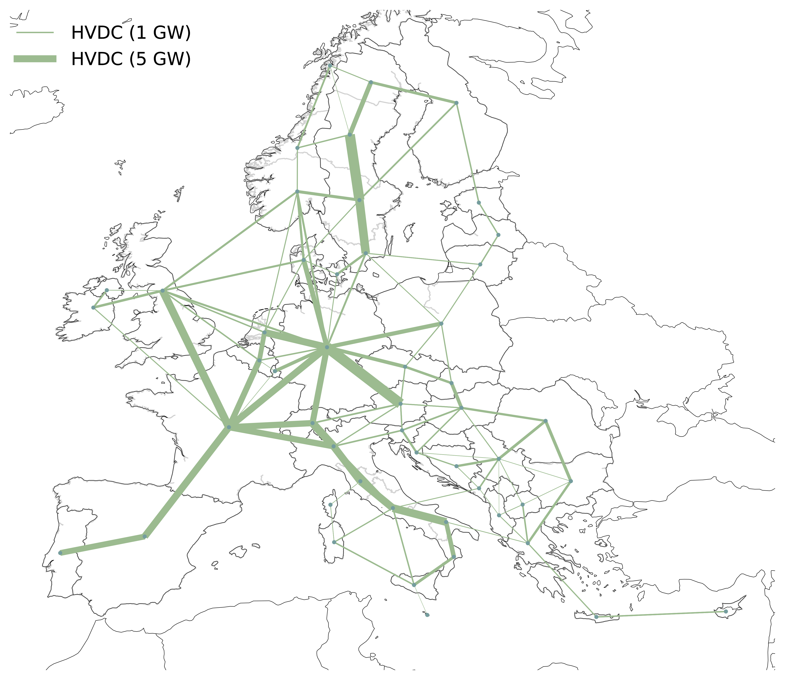
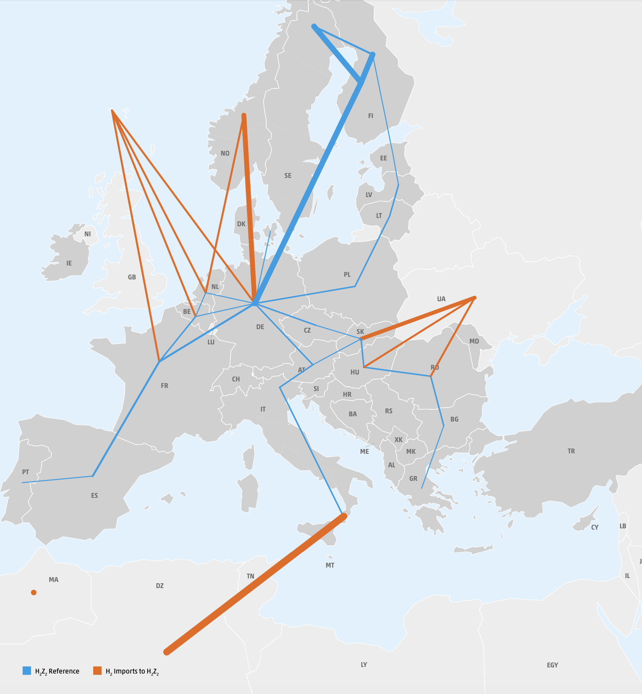
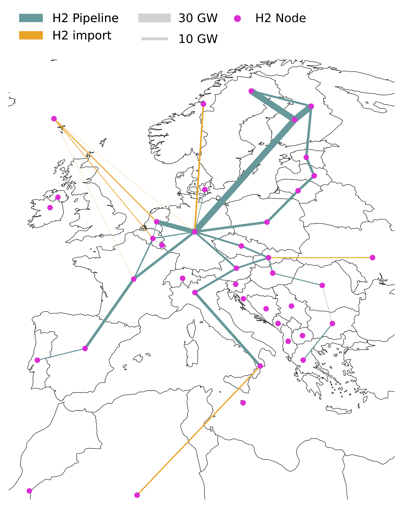
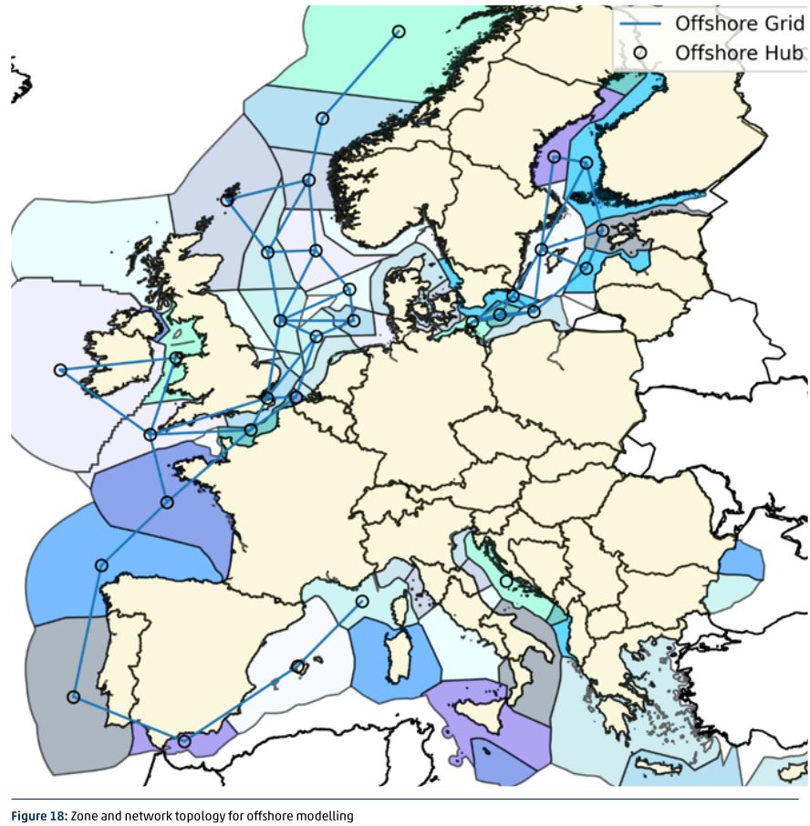
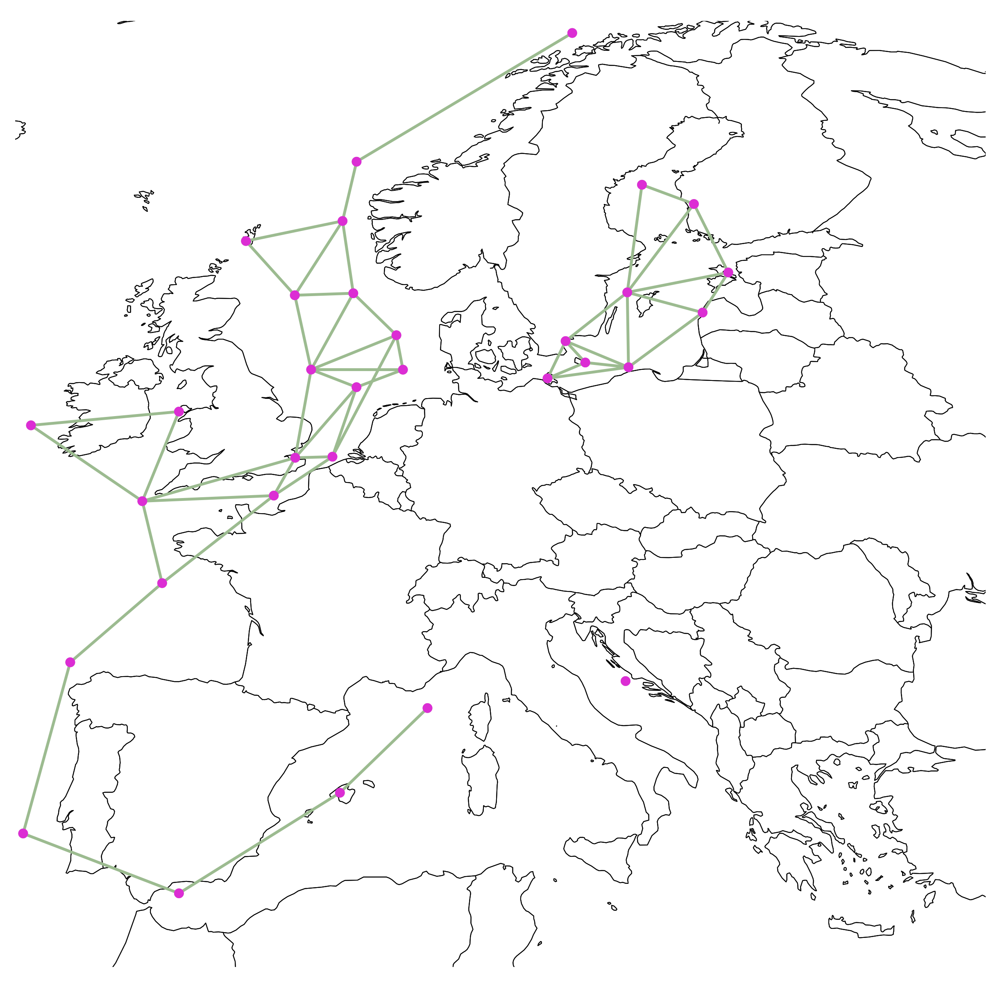
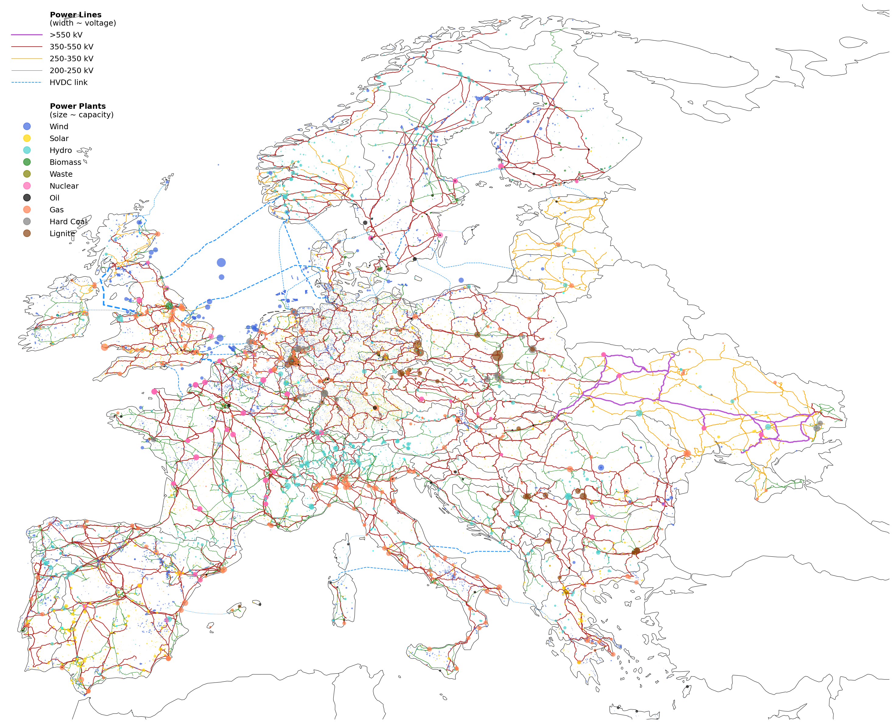

<!-- SPDX-FileCopyrightText: Contributors to Open-TYNDP <https://github.com/open-energy-transition/open-tyndp> -->
<!-- SPDX-FileCopyrightText: Contributors to PyPSA-Eur <https://github.com/pypsa/pypsa-eur> -->
<!-- SPDX-License-Identifier: CC-BY-4.0 -->

# Open-TYNDP: Interfacing Open Energy System Planning with ENTSO-E Models and Contributing to TYNDP


[](https://github.com/open-energy-transition/open-tyndp/actions)
[](https://pypsa-eur.readthedocs.io/en/latest/?badge=latest)

[](https://doi.org/10.5281/zenodo.19372053)
[](https://doi.org/10.5281/zenodo.3520874)
[](https://doi.org/10.5281/zenodo.3938042)
[](https://doi.org/10.5281/zenodo.14230568)
[](https://snakemake.readthedocs.io)
[](https://discord.gg/AnuJBk23FU)
[](https://api.reuse.software/info/github.com/open-energy-transition/open-tyndp)

|

!!! warning
    Open-TYNDP is under active development and is not yet feature-complete. The current [development status](#development-status) and the general [Limitations](limitations.md) are important to understand before using the model.


This repository introduces the open-source model of the Open-TYNDP research and innovation project, which is a collaboration between [Open Energy Transition (OET)](https://openenergytransition.org/) and the European Network of Transmission System Operators for Electricity (ENTSO-E).
The project's aim is to explore the capabilities of an open-source tool to replicate the Ten-Year Network Development Plan (TYNDP) 2024 by building a workflow based on [PyPSA-Eur](https://github.com/pypsa/pypsa-eur).
It seeks to complement the tools currently used in the TYNDP cycles, especially for Scenario Building (SB) and Cost-Benefit Analysis (CBA). This approach is designed to enhance transparency and lower barriers to stakeholder participation in European energy planning. Beyond Europe, the project aspires to demonstrate the viability of open-source (OS) frameworks in energy planning, encouraging broader global adoption.

To build trust in and ensure reproducibility with the new open-source toolchain, the project first focuses on replicating key figures from the 2024 TYNDP cycle. This process involves developing new features within the open-source domain to address existing gaps, integrating tools for data interoperability and dynamic visualizations, and publishing best practices to encourage the adoption of open energy models. Additionally, the project emphasizes stakeholder consultations and [interactive workshops](https://open-energy-transition.github.io/open-tyndp-workshops/intro.html) alongside the development of the open-source tool, further promoting collaboration and transparency throughout the process.

First outcomes for the TYNDP 2024 NT scenario are presented [here](https://open-tyndp.openenergytransition.org/), while preliminary outcomes and outputs for every release can be found on [Zenodo](https://zenodo.org/records/19388086).

This repository is a soft-fork of [OET/PyPSA-Eur](https://github.com/open-energy-transition/pypsa-eur) and contains the entire project `Open-TYNDP` supported by OET, including code and documentation. The philosophy behind this repository is that no intermediary results are included, but all results are computed from raw data and code.

Beyond Europe, the project aspires to demonstrate the viability of open-source (OS) frameworks in energy planning, encouraging broader global adoption. To build trust and ensure reproducibility, the project focuses on replicating key figures from the 2024 TYNDP cycle before aligning with current and future TYNDP cycles.

## Why Open-TYNDP?

- **Transparency** — Not only assumptions and inputs are visible and auditable, but the models themselves are fully open.
- **Reproducibility** — Any stakeholder is able to re-run the TYNDP 2024 National Trends scenario independently.
- **Additional Resource** — Facilitates broader expert contribution and peer review.
- **Automated Workflow** — The entire modelling process runs automatically from raw inputs to final outputs via [Snakemake](https://snakemake.readthedocs.io/) and [pixi](https://pixi.prefix.dev/).

## What Can You Do Now?

- **Independently reproduce** and examine the official TYNDP 2024 National Trends scenario.
- **Test custom scenarios** (e.g., alternative demand or RES assumptions) without starting from scratch.
- **Directly compare** open-source model results with ENTSO-E outputs in a transparent framework.
- **Collaborate** more easily across organizations using a shared, community-maintained codebase.
- **Scale globally** — Use the framework for regional data beyond Europe for transmission planning.

## Who Benefits from This?

- **TSO planners** — Faster iteration on grid investment scenarios and easier sensitivity analysis.
- **ENTSO-E leadership** — Credible, independent benchmarking builds process legitimacy.
- **Researchers & policymakers** — Full access to a pan-European model calibrated to official TYNDP 2024 data.
- **Grid planners beyond Europe** — A reusable framework for regional energy planning.

## Open-Source ecosystem

The Open-TYNDP repository builds on the open-source ecosystem of [PyPSA](https://github.com/pypsa/pypsa) and [PyPSA-Eur](https://github.com/pypsa/pypsa-eur) which are developed and maintained by several organizations, including [Open Energy Transition (OET)](https://openenergytransition.org/), [Technische Universität Berlin (TUB)](https://www.tu.berlin/en/ensys/), [Fraunhofer](https://www.fraunhofer.de/), [Ostbayerische Technische Hochschule (OTH)](https://www.oth-regensburg.de/en/), [Universita di Pisa (UNIPI)](https://www.unipi.it/en/) and [Danmarks Tekniske Universitet (DTU)](https://www.dtu.dk/english/). This group of maintainers consists of individuals who have significantly contributed to the projects over time and earned the authority to review and accept change requests. This privilege comes with the responsibility to continuously work on the repository and contribute to enhancements, stability, security and more. This worldwide ecosystem involves energy researchers, system operators, regulators, NGOs, and policymakers.



Within this ecosystem, independent organisations can develop their own private repositories using the publicly available Open-TYNDP and PyPSA-Eur codebases. This shared foundation ensures interoperability and creates opportunities for partnership through sharing and co-developing features. By using a soft-fork strategy, each private repository can benefit from the shared research and development environment and voluntarily contribute features. The shared foundation also enables organisations to request support and feature development from other actors.

Each organisation in this open-source ecosystem remains fully independent of the shared foundation, maintaining its own governance structure and decision-making processes regarding its codebase. Organisations are also free to keep parts of their code and sensitive data completely private.

|

## Development status {#development-status}

!!! warning
    Open-TYNDP is under active development and is not yet feature-complete. The current development status and general [limitations](limitations.md) are important to understand before using the model. The model includes partial data from the TYNDP 2024 cycle, and its benchmarking is ongoing. The github repository [issues](https://github.com/open-energy-transition/open-tyndp/issues) collects known topics we are working on (please feel free to help or make suggestions). The fact that this project relies on a soft-fork strategy implies that [upstream issues](https://github.com/PyPSA/PyPSA-Eur/issues) need to be addressed in the PyPSA-Eur repository. This [documentation](https://open-tyndp.readthedocs.io/) also remains work in progress.

### Already implemented features

The back-casting of the 2024 TYNDP cycle involves developing new features based on the published [modelling methodology report](https://2024.entsos-tyndp-scenarios.eu/wp-content/uploads/2025/01/TYNDP_2024_Scenarios_Methodology_Report_Final_Version_250128.pdf). Major and already implemented features are summarized below. Please, refer to the [release_notes](release_notes.md) for a more comprehensive list of features and to the relevant [pull requests](https://github.com/open-energy-transition/open-tyndp/pulls?q=is%3Apr+label%3A%22major+feature%22) for extensive documentation of the implementations.

- Introduced a benchmarking framework that assesses Open-TYNDP quality against published TYNDP 2024 data from the report, the market model outputs and the Visualisation Platform (see PRs [#73](https://github.com/open-energy-transition/open-tyndp/pull/73), [#117](https://github.com/open-energy-transition/open-tyndp/pull/117), [#281](https://github.com/open-energy-transition/open-tyndp/pull/281), [#467](https://github.com/open-energy-transition/open-tyndp/pull/467), [#543](https://github.com/open-energy-transition/open-tyndp/pull/543), [#574](https://github.com/open-energy-transition/open-tyndp/pull/574), [#607](https://github.com/open-energy-transition/open-tyndp/pull/607), [#615](https://github.com/open-energy-transition/open-tyndp/pull/615), [#609](https://github.com/open-energy-transition/open-tyndp/pull/609), [#604](https://github.com/open-energy-transition/open-tyndp/pull/604), [#667](https://github.com/open-energy-transition/open-tyndp/pull/667), [#663](https://github.com/open-energy-transition/open-tyndp/pull/663), [#657](https://github.com/open-energy-transition/open-tyndp/pull/657), [#680](https://github.com/open-energy-transition/open-tyndp/pull/680) and [#718](https://github.com/open-energy-transition/open-tyndp/pull/718)).
- Introduced the electricity and hydrogen reference grids from TYNDP 2024 grid data (see PRs [#18](https://github.com/open-energy-transition/open-tyndp/pull/18), [#17](https://github.com/open-energy-transition/open-tyndp/pull/17), [#340](https://github.com/open-energy-transition/open-tyndp/pull/340), [#475](https://github.com/open-energy-transition/open-tyndp/pull/475), [#489](https://github.com/open-energy-transition/open-tyndp/pull/489), [#496](https://github.com/open-energy-transition/open-tyndp/pull/496), [#527](https://github.com/open-energy-transition/open-tyndp/pull/527), [#537](https://github.com/open-energy-transition/open-tyndp/pull/537), [#611](https://github.com/open-energy-transition/open-tyndp/pull/611)), including hydrogen import potentials and corridors from outside of the modelled countries (see PR [#36](https://github.com/open-energy-transition/open-tyndp/pull/36)).
- Introduced TYNDP offshore wind hubs topology with both electric and hydrogen infrastructure, offshore electrolysers, and detailed wind farm characteristics (see PR [#54](https://github.com/open-energy-transition/open-tyndp/pull/54), [#654](https://github.com/open-energy-transition/open-tyndp/pull/654) and [#656](https://github.com/open-energy-transition/open-tyndp/pull/656)).
- Added processing, preparation and attaching of PECD v3.1 renewable profiles and PEMMDB v2.5 hydro inflows to their corresponding components (see PRs [#53](https://github.com/open-energy-transition/open-tyndp/pull/53), [#71](https://github.com/open-energy-transition/open-tyndp/pull/71), [#473](https://github.com/open-energy-transition/open-tyndp/pull/473) for PECD; [#77](https://github.com/open-energy-transition/open-tyndp/pull/77), [#338](https://github.com/open-energy-transition/open-tyndp/pull/338) for PEMMDB hydro inflows).
- Added processing and preparation of PEMMDB v2.5 capacity, must-run, and availability data, along with expansion trajectories for conventional and renewable power generation, electrolysers, batteries, and DSR (see PR [#97](https://github.com/open-energy-transition/open-tyndp/pull/97)).
- Added the TYNDP electricity, hydrogen, methane demands as exogenous demands (see PRs [#14](https://github.com/open-energy-transition/open-tyndp/pull/14) for electricity; [#169](https://github.com/open-energy-transition/open-tyndp/pull/169), [#230](https://github.com/open-energy-transition/open-tyndp/pull/230) and [#531](https://github.com/open-energy-transition/open-tyndp/pull/531) for hydrogen; and [#208](https://github.com/open-energy-transition/open-tyndp/pull/208) and [#220](https://github.com/open-energy-transition/open-tyndp/pull/220) for methane).
- Added option to use the TYNDP H2 topology including the TYNDP H2 reference grid, H2 Z1 and Z2 setup, production, reconversion and storage technologies (see PR [#17](https://github.com/open-energy-transition/open-tyndp/pull/17)).
- Added TYNDP solar, onwind, hydro, conventional thermal, other RES, other non-RES and DSR generation using PEMMDB capacities, must-runs and availabilities (see PRs [#115](https://github.com/open-energy-transition/open-tyndp/pull/115), [#139](https://github.com/open-energy-transition/open-tyndp/pull/139) and [#564](https://github.com/open-energy-transition/open-tyndp/pull/564) for solar and onwind; [#338](https://github.com/open-energy-transition/open-tyndp/pull/338) for hydro; [#195](https://github.com/open-energy-transition/open-tyndp/pull/195) for conventionals; [#521](https://github.com/open-energy-transition/open-tyndp/pull/521) for Other RES; [#535](https://github.com/open-energy-transition/open-tyndp/pull/535) for Other Non-RES; [#598](https://github.com/open-energy-transition/open-tyndp/pull/598) for DSR), electrolyzer PEMMDB capacities (only for NT scenario) (see PR [#248](https://github.com/open-energy-transition/open-tyndp/pull/248)) and load shedding (see PRs [#494](https://github.com/open-energy-transition/open-tyndp/pull/494), [#505](https://github.com/open-energy-transition/open-tyndp/pull/505) and [#547](https://github.com/open-energy-transition/open-tyndp/pull/547)).
- Added CO2 emission prices per planning horizon (see PR [#198](https://github.com/open-energy-transition/open-tyndp/pull/198)).
- Introduced a workflow structure for performing Cost-Benefit Analysis (CBA) using both TOOT (Take One Out at a Time) and PINT (Put In at a Time) methodologies for TYNDP transmission and storage projects on top of the SB results (see PR [#149](https://github.com/open-energy-transition/open-tyndp/pull/149)).
- Added the PINT and TOOT reference and project network preparation for CBA (see PRs [#199](https://github.com/open-energy-transition/open-tyndp/pull/199), [#211](https://github.com/open-energy-transition/open-tyndp/pull/211), [#353](https://github.com/open-energy-transition/open-tyndp/pull/353), [#426](https://github.com/open-energy-transition/open-tyndp/pull/426)).
- Added weekly rolling horizon optimization for CBA networks (see PRs [#217](https://github.com/open-energy-transition/open-tyndp/pull/217), [#385](https://github.com/open-energy-transition/open-tyndp/pull/385), [#441](https://github.com/open-energy-transition/open-tyndp/pull/441)).
- Introduced calculation of B1, B2, B3 and B4 indicator in the CBA (see PRs [#186](https://github.com/open-energy-transition/open-tyndp/pull/186), [#523](https://github.com/open-energy-transition/open-tyndp/pull/523), [#578](https://github.com/open-energy-transition/open-tyndp/pull/578), [#348](https://github.com/open-energy-transition/open-tyndp/pull/348), [#350](https://github.com/open-energy-transition/open-tyndp/pull/350), [#398](https://github.com/open-energy-transition/open-tyndp/pull/398), [#668](https://github.com/open-energy-transition/open-tyndp/pull/668)).
- Added automated Windows installer with Azure Artifact Signing for easy setup on Windows systems (see PR [#333](https://github.com/open-energy-transition/open-tyndp/pull/333), [#471](https://github.com/open-energy-transition/open-tyndp/pull/471)).
- Automatically launched PyPSA-Explorer to investigate run results (see PR [#443](https://github.com/open-energy-transition/open-tyndp/pull/443)).
- Added SMR (grey hydrogen) and SMR + Carbon Capture (blue hydrogen) capacities and assumptions from TYNDP 2024 hydrogen data and enabled H2 load shedding with cost of 3000 EUR/MWh_H2 (see PR [#490](https://github.com/open-energy-transition/open-tyndp/pull/490)).
- Added H2 cavern and tank storages with existing energy and charge/discharge capacities (see PR [#552](https://github.com/open-energy-transition/open-tyndp/pull/552)).
- Added PEMMDB common data assumptions from ERAA 2025 for power plant type specific efficiencies and VOM (see PR [#541](https://github.com/open-energy-transition/open-tyndp/pull/541)).
- Added battery store capacities and assumptions using PEMMDB data (see PR [#253](https://github.com/open-energy-transition/open-tyndp/pull/253/)).
- Added Open-TYNDP data store option for fully reproducible runs without third-party data providers (see PR [#682](https://github.com/open-energy-transition/open-tyndp/pull/682)). Six datasets currently remain to be retrieved from primary sources due to licensing constraints.

<table style="margin: 0 auto;">
<thead><tr><th><strong>Feature</strong></th><th><strong>TYNDP 2024 topology</strong></th><th><strong>Open-TYNDP topology</strong></th></tr></thead>
<tbody>
<tr><td><strong>Electricity Grid</strong></td><td style="text-align: center;"></td><td style="text-align: center;"></td></tr>
<tr><td><strong>Hydrogen Grid</strong></td><td style="text-align: center;"></td><td style="text-align: center;"></td></tr>
<tr><td><strong>Offshore Grid</strong></td><td style="text-align: center;"></td><td style="text-align: center;"></td></tr>
</tbody>
</table>

|

### Features in development

While multiple TYNDP features are already introduced to the Open-TYNDP model, there are several other features and assumptions that are still in development and currently rely on default implementations and assumptions from PyPSA-Eur.

| **Milestone** | **Feature** | **PR** | **Status** |
|---|---|---|---|
| **Visualizations and workflow automation** | Automated workflow | | ✅ |
| | TYNDP plotting routines | [#443](https://github.com/open-energy-transition/open-tyndp/pull/443), [#669](https://github.com/open-energy-transition/open-tyndp/pull/669) | 🔨 |
| **Automated tests and benchmarks** | Automated benchmarking routine | [#73](https://github.com/open-energy-transition/open-tyndp/pull/73), [#117](https://github.com/open-energy-transition/open-tyndp/pull/117), [#281](https://github.com/open-energy-transition/open-tyndp/pull/281), [#467](https://github.com/open-energy-transition/open-tyndp/pull/467), [#543](https://github.com/open-energy-transition/open-tyndp/pull/543), [#574](https://github.com/open-energy-transition/open-tyndp/pull/574), [#607](https://github.com/open-energy-transition/open-tyndp/pull/607), [#615](https://github.com/open-energy-transition/open-tyndp/pull/615), [#609](https://github.com/open-energy-transition/open-tyndp/pull/609), [#604](https://github.com/open-energy-transition/open-tyndp/pull/604), [#667](https://github.com/open-energy-transition/open-tyndp/pull/667), [#663](https://github.com/open-energy-transition/open-tyndp/pull/663), [#657](https://github.com/open-energy-transition/open-tyndp/pull/657), [#680](https://github.com/open-energy-transition/open-tyndp/pull/680), [#718](https://github.com/open-energy-transition/open-tyndp/pull/718) | ✅ |
| **TYNDP modelling features** | Perfect foresight optimization | | ⌛ |
| | Security of Supply (SoS) loop | | ⌛ |
| **Existing infrastructure and associated parameters** | Electricity reference grid | [#18](https://github.com/open-energy-transition/open-tyndp/pull/18), [#340](https://github.com/open-energy-transition/open-tyndp/pull/340), [#489](https://github.com/open-energy-transition/open-tyndp/pull/489), [#496](https://github.com/open-energy-transition/open-tyndp/pull/496), [#527](https://github.com/open-energy-transition/open-tyndp/pull/527) | ✅ |
| | Hydrogen reference grid | [#17](https://github.com/open-energy-transition/open-tyndp/pull/17), [#36](https://github.com/open-energy-transition/open-tyndp/pull/36), [#475](https://github.com/open-energy-transition/open-tyndp/pull/475), [#537](https://github.com/open-energy-transition/open-tyndp/pull/537), [#611](https://github.com/open-energy-transition/open-tyndp/pull/611) | ✅ |
| | Offshore grid | [#54](https://github.com/open-energy-transition/open-tyndp/pull/54), [#654](https://github.com/open-energy-transition/open-tyndp/pull/654), [#656](https://github.com/open-energy-transition/open-tyndp/pull/656) | ✅ |
| | PECD data | [#53](https://github.com/open-energy-transition/open-tyndp/pull/53), [#71](https://github.com/open-energy-transition/open-tyndp/pull/71), [#473](https://github.com/open-energy-transition/open-tyndp/pull/473) | ✅ |
| | Hydro inflows | [#77](https://github.com/open-energy-transition/open-tyndp/pull/77), [#338](https://github.com/open-energy-transition/open-tyndp/pull/338) | ✅ |
| | PEMMDB capacities & must-runs processing | [#97](https://github.com/open-energy-transition/open-tyndp/pull/97) | ✅ |
| | Investment candidates trajectories processing | [#97](https://github.com/open-energy-transition/open-tyndp/pull/97) | ✅ |
| **TYNDP demand** | Electricity | [#14](https://github.com/open-energy-transition/open-tyndp/pull/14) | ✅ |
| | Hydrogen | [#169](https://github.com/open-energy-transition/open-tyndp/pull/169), [#230](https://github.com/open-energy-transition/open-tyndp/pull/230), [#531](https://github.com/open-energy-transition/open-tyndp/pull/531) | ✅ |
| | Methane | [#208](https://github.com/open-energy-transition/open-tyndp/pull/208), [#220](https://github.com/open-energy-transition/open-tyndp/pull/220) | 🔨 |
| | Synthetic fuels | | ⌛ |
| | District heating | | ⌛ |
| | Energy imports | | ⌛ |
| **TYNDP technologies and carriers** | TYNDP generation technologies (incl. SRES and DRES) | [#115](https://github.com/open-energy-transition/open-tyndp/pull/115), [#139](https://github.com/open-energy-transition/open-tyndp/pull/139), [#195](https://github.com/open-energy-transition/open-tyndp/pull/195), [#248](https://github.com/open-energy-transition/open-tyndp/pull/248), [#338](https://github.com/open-energy-transition/open-tyndp/pull/338), [#447](https://github.com/open-energy-transition/open-tyndp/pull/447), [#494](https://github.com/open-energy-transition/open-tyndp/pull/494), [#505](https://github.com/open-energy-transition/open-tyndp/pull/505), [#490](https://github.com/open-energy-transition/open-tyndp/pull/490), [#521](https://github.com/open-energy-transition/open-tyndp/pull/521), [#535](https://github.com/open-energy-transition/open-tyndp/pull/535), [#564](https://github.com/open-energy-transition/open-tyndp/pull/564), [#552](https://github.com/open-energy-transition/open-tyndp/pull/552), [#541](https://github.com/open-energy-transition/open-tyndp/pull/541), [#253](https://github.com/open-energy-transition/open-tyndp/pull/253), [#598](https://github.com/open-energy-transition/open-tyndp/pull/598), [#547](https://github.com/open-energy-transition/open-tyndp/pull/547) | 🔨 |
| | Prosumer modelling | | ⌛ |
| | EV modelling | | ⌛ |
| | Synthetic fuel carriers | | ⌛ |
| | Hybrid heat pumps | | ⌛ |
| | Industrial electricity and hydrogen demands | | ⌛ |
| | Hydrogen zones | [#17](https://github.com/open-energy-transition/open-tyndp/pull/17) | ✅ |
| **CBA Assessment Framework** | TOOT/PINT methodology | [#149](https://github.com/open-energy-transition/open-tyndp/pull/149), [#199](https://github.com/open-energy-transition/open-tyndp/pull/199), [#211](https://github.com/open-energy-transition/open-tyndp/pull/211), [#217](https://github.com/open-energy-transition/open-tyndp/pull/217), [#353](https://github.com/open-energy-transition/open-tyndp/pull/353), [#385](https://github.com/open-energy-transition/open-tyndp/pull/385), [#426](https://github.com/open-energy-transition/open-tyndp/pull/426) | 🔨 |
| | Climate years (weighted average) | [#529](https://github.com/open-energy-transition/open-tyndp/pull/529) | 🔨 |
| | **CBA Benchmarking** | [#405](https://github.com/open-energy-transition/open-tyndp/pull/405) | ✅ |
| **CBA Benefit Indicators** | B1: Socioeconomic Welfare (SEW) | [#186](https://github.com/open-energy-transition/open-tyndp/pull/186), [#523](https://github.com/open-energy-transition/open-tyndp/pull/523), [#578](https://github.com/open-energy-transition/open-tyndp/pull/578), [#668](https://github.com/open-energy-transition/open-tyndp/pull/668) | ✅ |
| | B2: CO₂ Variation with societal costs | [#348](https://github.com/open-energy-transition/open-tyndp/pull/348), [#709](https://github.com/open-energy-transition/open-tyndp/pull/709) | ✅ |
| | B3: DRES Integration (curtailment reduction) | [#350](https://github.com/open-energy-transition/open-tyndp/pull/350) | ✅ |
| | B4: Non-CO₂ Emissions (NOx, SOx, PM2.5/10, NMVOC, NH₃) | [#398](https://github.com/open-energy-transition/open-tyndp/pull/398), [#709](https://github.com/open-energy-transition/open-tyndp/pull/709) | ✅ |
| | B5: Grid Losses, B6: Adequacy, B7: Flexibility, B8: Stability, B9: Reserves reduction | n/a | |

!!! note "See also"
    See also the [GitHub repository issues](https://github.com/open-energy-transition/open-tyndp/issues) for a comprehensive list of currently open issues.

|

## Citing Open-TYNDP

If you want to cite a specific Open-TYNDP version, since v0.6, each release is archived on Zenodo with a release-specific DOI:

[](https://doi.org/10.5281/zenodo.19372053)

|

Versions v0.5 and v0.5.1 are archived at [10.5281/zenodo.18494362](https://doi.org/10.5281/zenodo.18494362).

If you use Open-TYNDP in your research, please cite it as shown on Zenodo or using the "Cite this repository" button in the sidebar of [Open-TYNDP](https://github.com/open-energy-transition/open-tyndp).

This work builds upon [PyPSA-Eur](https://github.com/pypsa/pypsa-eur) and follows the methodology described in [ENTSO-E's and entsog's TYNDP 2024 Scenarios Methodology Report](https://2024.entsos-tyndp-scenarios.eu/scenarios-methodology-report/).

|

## Background on PyPSA-Eur

### Electricity System

The electricity system representation contains alternating current lines at
and above 220 kV voltage level and all high voltage direct current lines,
substations, an open database of conventional power plants, time series for
electrical demand and variable renewable generator availability, geographic
potentials for the expansion of wind and solar power.

The model is suitable both for operational studies and generation and
transmission expansion planning studies. The continental scope and highly
resolved spatial scale enables a proper description of the long-range smoothing
effects for renewable power generation and their varying resource availability.

{width=70%}

### Sector-Coupled Energy System

A sector-coupled extension (previously known as **PyPSA-Eur-Sec**, which is now
deprecated) adds demand and supply for the following sectors: transport, space
and water heating, biomass, energy consumption in the agriculture, industry and
industrial feedstocks, carbon management, carbon capture and
usage/sequestration. This completes the energy system and includes all
greenhouse gas emitters except waste management, agriculture, forestry and land
use. The diagram below gives an overview of the sectors and the links between
them:

{width=70%}

!!! note
    You can find showcases of the model's capabilities in the Supplementary Materials of the
    Joule paper [The potential role of a hydrogen network in Europe](https://doi.org/10.1016/j.joule.2023.06.016), the Supplementary Materials of another [paper in Joule with a
    description of the industry sector](https://doi.org/10.1016/j.joule.2022.04.016), or in [a 2021 presentation
    at EMP-E](https://nworbmot.org/energy/brown-empe.pdf).
    The sector-coupled extension of PyPSA-Eur was
    initially described in the paper [Synergies of sector coupling and transmission
    reinforcement in a cost-optimised, highly renewable European energy system](https://arxiv.org/abs/1801.05290) (2018) but it differs by being based on the
    higher resolution electricity transmission model [PyPSA-Eur](https://github.com/PyPSA/pypsa-eur) rather than a one-node-per-country model,
    and by including biomass, industry, industrial feedstocks, aviation, shipping,
    better carbon management, carbon capture and usage/sequestration, and gas
    networks.

### About

PyPSA-Eur is designed to be imported into the open energy system modelling
framework [PyPSA](https://www.pypsa.org) for which [documentation](https://pypsa.readthedocs.io) is available as well. However, since the
workflow is modular, it should be easy to adapt the data workflow to other
modelling frameworks.

The restriction to freely available and open data encourages the open exchange
of model data developments and eases the comparison of model results. It
provides a full, automated software pipeline to assemble the load-flow-ready
model from the original datasets, which enables easy replacement and improvement
of the individual parts.

!!! warning
    PyPSA-Eur is under active development and has several
    [limitations](limitations.md) which
    you should understand before using the model. The Github repository
    [issues](https://github.com/PyPSA/pypsa-eur/issues) collect known
    topics we are working on. Please feel free to help or make suggestions.

This project is currently maintained by the [Department of Digital
Transformation in Energy Systems](https://www.tu.berlin/en/ensys) at the
[Technische Universität Berlin](https://www.tu.berlin). Previous versions were
developed within the [IAI](http://www.iai.kit.edu) at the [Karlsruhe Institute
of Technology (KIT)](http://www.kit.edu/english/index.php) which was funded by
the [Helmholtz Association](https://www.helmholtz.de/en/), and by the
[Renewable Energy Group](https://fias.uni-frankfurt.de/physics/schramm/renewable-energy-system-and-network-analysis/)
at [FIAS](https://fias.uni-frankfurt.de/) to carry out simulations for the
[CoNDyNet project](http://condynet.de/), financed by the [German Federal
Ministry for Education and Research (BMBF)](https://www.bmbf.de/en/index.html)
as part of the [Stromnetze Research Initiative](http://forschung-stromnetze.info/projekte/grundlagen-und-konzepte-fuer-effiziente-dezentrale-stromnetze/).

### Workflow

[](img/workflow.svg)

!!! note
    The graph above was generated using
    `pixi run snakemake --rulegraph -F | sed -n "/digraph/,/}/p" | dot -Tsvg -o doc/img/workflow.svg`

### Learning Energy System Modelling

If you are (relatively) new to energy system modelling and optimisation and plan
to use PyPSA-Eur, the following resources are one way to get started in addition
to reading this documentation.

- Documentation of [PyPSA](https://pypsa.readthedocs.io), the package for
  modelling energy systems which PyPSA-Eur uses under the hood.
- Course on [Energy Systems](https://nworbmot.org/courses/es-22/) given at
  Technical University of Berlin by [Prof. Dr. Tom Brown](https://nworbmot.org).
- Course on [Data Science for Energy System Modelling](https://fneum.github.io/data-science-for-esm/intro.html)
  given at Technical University of Berlin by [Dr. Fabian Neumann](https://neumann.fyi).

### Citing PyPSA-Eur

If you use PyPSA-Eur for your research, we would appreciate it if you would cite one of the following papers:

For electricity-only studies:

```bibtex
@article{PyPSAEur,
    author = "Jonas Hoersch and Fabian Hofmann and David Schlachtberger and Tom Brown",
    title = "PyPSA-Eur: An open optimisation model of the European transmission system",
    journal = "Energy Strategy Reviews",
    volume = "22",
    pages = "207--215",
    year = "2018",
    doi = "10.1016/j.esr.2018.08.012",
    eprint = "1806.01613"
}
```

For sector-coupling studies:

```bibtex
@misc{PyPSAEurSec,
    author = "Fabian Neumann and Elisabeth Zeyen and Marta Victoria and Tom Brown",
    title = "The potential role of a hydrogen network in Europe",
    journal = "Joule",
    volume = "7",
    pages = "1--25",
    year = "2023",
    eprint = "2207.05816",
    doi = "10.1016/j.joule.2023.06.016",
}
```

For sector-coupling studies with pathway optimisation:

```bibtex
@article{SpeedTechnological2022,
    title = "Speed of technological transformations required in {Europe} to achieve different climate goals",
    author = "Marta Victoria and Elisabeth Zeyen and Tom Brown",
    journal = "Joule",
    volume = "6",
    number = "5",
    pages = "1066--1086",
    year = "2022",
    doi = "10.1016/j.joule.2022.04.016",
    eprint = "2109.09563",
}
```

If you want to cite a specific PyPSA-Eur version, each release of PyPSA-Eur is stored on Zenodo with a release-specific DOI:

[](https://doi.org/10.5281/zenodo.3520874)

### Operating Systems

The PyPSA-Eur workflow is continuously tested for Linux, macOS and Windows (WSL only).

|
