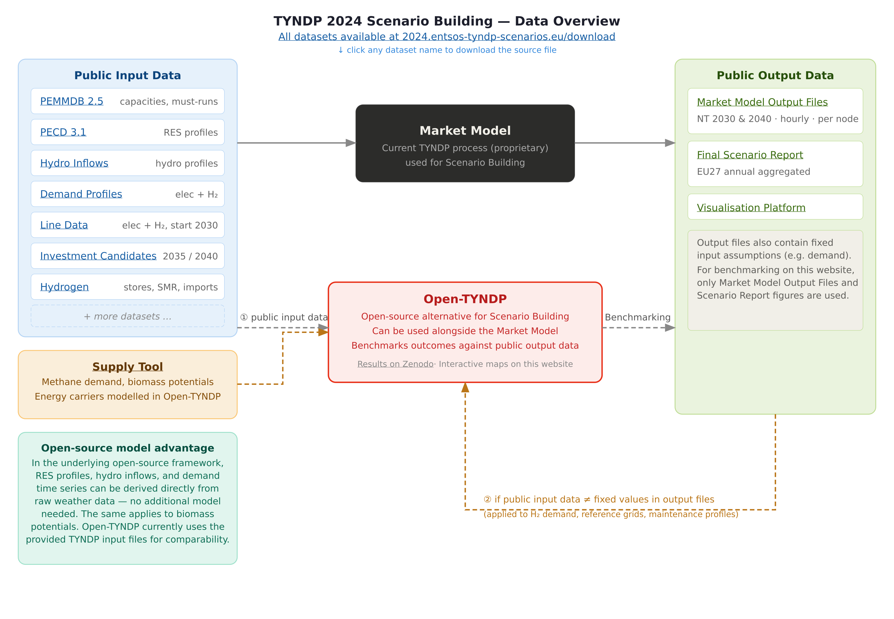

.. SPDX-FileCopyrightText: Contributors to Open-TYNDP <https://github.com/open-energy-transition/open-tyndp>
..
.. SPDX-License-Identifier: CC-BY-4.0

######################
Scenario Building (SB)
######################

Scenario Building (SB) is the first phase of the Open-TYNDP workflow. Starting from raw
ENTSO-E input datasets, it constructs a sector-coupled European energy system model
and solves a least-cost capacity expansion (DE and GA scenarios only, see `Open-TYNDP scenarios <scenarios.html>`_) and dispatch optimisation. The solved network
produced by SB serves as the direct input to the `Cost-Benefit Analysis (CBA) <cba.html>`_.

Open-TYNDP implements the `TYNDP 2024 Scenario Building methodology
<https://www.entsoe.eu/outlooks/tyndp/2024/>`_ as a soft-fork of
`PyPSA-Eur <https://pypsa-eur.readthedocs.io/en/latest/>`_, inheriting its modelling
framework (optimisation structure, network representation, and sector-coupling capabilities)
while replacing specific inputs and assumptions to match TYNDP 2024 reference data.

Input Data
==========

All used input datasets are publicly available from the `TYNDP 2024 scenarios download page
<https://2024.entsos-tyndp-scenarios.eu/download/>`_. The diagram below shows how they
flow into Open-TYNDP and into the benchmarking process.

Public input data from ENTSO-E is used wherever available. Where publicly available data does
not match the fixed values observed in the Market Model output files, the output files are used
as the reference for fixed input assumptions. This applies strictly to exogenous variables that
are not part of the optimisation (H₂ demand profiles, reference grid topologies,
and generator maintenance profiles).

The following datasets are ingested and processed by dedicated ``build_tyndp_*`` Snakemake
rules:

`PEMMDB 2.5 <https://2024-data.entsos-tyndp-scenarios.eu/files/scenarios-inputs/PEMMDB2.zip>`_
    Installed generation and storage capacities, must-run constraints, and per-unit cost
    assumptions by country and technology. Also provides efficiency and variable O&M parameters
    for conventional thermal generation sourced from ERAA 2025.

`PECD 3.1 <https://2024-data.entsos-tyndp-scenarios.eu/files/scenarios-inputs/PECD.zip>`_
    Hourly capacity factor time series for wind (onshore and offshore) and solar PV, derived
    from ERA5 reanalysis data. Profiles are provided per climate year and TYNDP bidding zone.

`Hydro Inflows <https://2024-data.entsos-tyndp-scenarios.eu/files/scenarios-inputs/Hydro-Inflows.zip>`_
    Hourly inflow profiles for reservoir and run-of-river hydro plants, used to constrain
    hydro dispatch across planning horizons. Profiles are provided per climate year and TYNDP bidding zone.

`Demand Profiles <https://2024-data.entsos-tyndp-scenarios.eu/files/scenarios-inputs/Demand-Profiles.zip>`_
    Hourly electricity and hydrogen demand profiles by country, interpolated to the target
    planning horizon. Where public profiles do not match fixed values in the Market Model output
    files, the output files are used as the reference.

`Line Data <https://2024-data.entsos-tyndp-scenarios.eu/files/scenarios-inputs/Line-data.zip>`_
    Electricity and hydrogen transmission network topology for both the reference grid and
    candidate lines. Electricity and H₂ line data are used from 2030 onward.

`Investment Candidates <https://2024-data.entsos-tyndp-scenarios.eu/files/scenarios-inputs/Investment-Datasets.zip>`_
    Optional extendable transmission and storage assets for the 2035 and 2040 planning horizons.

`Hydrogen <https://2024-data.entsos-tyndp-scenarios.eu/files/scenarios-inputs/Hydrogen.zip>`_
    Hydrogen storage parameters, steam methane reforming (SMR and SMR+CCS) capacities, and
    import pipeline assumptions.

`Supply Tool <https://2024-data.entsos-tyndp-scenarios.eu/files/scenarios-outputs/20240518-Supply-Tool.xlsm.zip>`_
    Methane demand and biomass potentials for energy carriers modelled in Open-TYNDP. This is
    a scenario output file from the TYNDP 2024 process used as a fixed input.

.. note::
    In the underlying PyPSA-Eur framework, RES profiles, hydro inflows, and demand time series
    can be derived directly from raw weather data without any additional model. The same applies
    to biomass potentials. Open-TYNDP currently uses the provided TYNDP input files for
    comparability with the established TYNDP 2024 methodology.

SB Workflow
===========

The SB workflow transforms raw ENTSO-E input datasets into a solved, sector-coupled PyPSA
network. The key stages are: integrating public input data, constructing the sector-coupled
network, applying TYNDP-specific constraints, solving the capacity expansion optimisation, visualising results, and running the Open-TYNDP `benchmarking framework <benchmarking.html>`_.

Network Construction
--------------------

The PyPSA network is built at **bidding zone / country-level resolution** for the electricity and hydrogen
sectors respectively. Buses represent national-level aggregations; AC lines and DC links represent
cross-border interconnectors with capacities and impedances taken from the TYNDP Line Data.

Generator and storage components are attached to country buses using PEMMDB 2.5 capacity data.
Which carriers are **extendable** varies by scenario and planning horizon.

Sector Coupling
---------------

Open-TYNDP models the electricity and hydrogen sectors as fully coupled. For the Distributed
Energy (DE) and Global Ambition (GA) scenarios, heating sector links are included in addition (see `Open-TYNDP scenarios <scenarios.html>`_). Cross-sector components
include:

* **Electrolysers:** Convert electricity to hydrogen; capacity is either fixed per PEMMDB 2.5
  or left extendable depending on the scenario.
* **Fuel cells and back-pressure plants:** Reconvert hydrogen or gas to electricity.
* **Hydrogen network:** Dedicated H₂ pipelines between country buses are included for planning
  horizons from 2030 onward, using TYNDP Line Data. Zones with split H₂ grids (e.g. the
  Iberian Peninsula) are represented with separate H₂ buses.
* **SMR and SMR+CCS:** Grey and blue hydrogen production capacities from PEMMDB and TYNDP
  hydrogen datasets.
* **Demand-side electrification:** Where the scenario specifies it, electricity demand
  incorporates direct electrification of heat and transport end-uses.

Capacity and Dispatch Optimisation
---------------------

The SB optimisation minimises **total annualised system cost** (variable operating cost, plus investment cost where capacity expansion is enabled) subject to:

* Hourly supply-demand balance for each carrier at every bus.
* Transmission capacity constraints, with optional extendability for candidate lines.
* CO₂ emission budgets derived from the TYNDP 2024 scenario pathway.
* Minimum and maximum generation constraints from PEMMDB, including must-run levels and
  scheduled maintenance outages.
* Country-level annual hydrogen supply and demand balances.
* Capacity expansion constraints reflecting given trajectories in the case of the DE and GA scenario

The problem is formulated as a **linear programme (LP)** and solved with the configured
solver (HiGHS as default as an open-source alternative for lower
temporal resolution runs; other solvers like Gurobi/Mosek are also supported and recommended for high-resolution runs).

Each planning horizon is solved independently using the capacity assumptions fixed for that
horizon. The solved ``network.nc`` file is retrieved by the CBA workflow as
its starting point. See the `CBA documentation <cba.html>`_ for details.

Configuration
=============

SB settings are split across ``config/config.tyndp.yaml`` (run-level settings) and
``config/scenarios.tyndp.yaml`` (scenario-specific overrides). You can refer to
the `configuration <configuration.html>`_ page for a more comprehensive list of available PyPSA-Eur
and Open-TYNDP configuration options.

Scenarios and Planning Horizons
--------------------------------

* ``scenario``: Selects the TYNDP 2024 scenario. Supported values are ``NT``
  (National Trends),  ``GA`` (Global Ambition) and ``DE`` (Distributed Energy).
* ``planning_horizons``: List of target years to solve (e.g. ``[2030, 2035, 2040, 2050]``). Each
  horizon is solved as an independent optimisation.
* ``run.name``: Identifies the run and determines the output directory; typically set to
  the scenario/climate-year identifier (e.g. ``NT-cy2009``).
  * ``launch_explorer``: Whether to launch the `PyPSA Explorer <https://github.com/open-energy-transition/pypsa-explorer>`_ after the model solve within the workflow. Default is ``True``.

Climate Years
-------------

Each scenario run is tied to a specific historical climate year, which determines the
renewable generation and hydro inflow profiles used from PECD 3.1 and Hydro Inflows:

* ``snapshots``: Defines the modelling time window, e.g.:

  .. code-block:: yaml

      snapshots:
        start: "2009-01-01"
        end:   "2009-12-31"
        inclusive: "left"

* ``atlite.default_cutout``: ERA5 reanalysis cutout used to compute PECD-compatible
  capacity factor profiles (e.g. ``europe-2009-era5``).

Solver Settings
---------------

* ``solving.solver.name``: Solver to use (e.g. ``gurobi``, ``highs``, or ``mosek``).
* ``solving.solver_options``: Solver-specific parameters such as optimality gap and
  memory limits.

.. _tyndp_archive:

Data Sources
------------

By default, Open-TYNDP retrieves input datasets from ``data.pypsa.org`` (``archive`` source)
or their original primary sources, meaning data is pulled from several different domains. As an alternative, most datasets are also mirrored to a
dedicated Google Cloud Storage bucket (``open-tyndp-data-store``) under the ``tyndp-archive``
source. This mirror consolidates downloads to a single URL, which can simplify IT or security approval processes. The Google Cloud Storage requires no account and all files are versioned for reproducibility.

To activate ``tyndp-archive`` for all supported datasets, set ``data_config: tyndp`` in any
of the following ways:

- Pass it on the command line:

  .. code-block:: console

      $ pixi run tyndp-sb -- --config data_config=tyndp

- Set it permanently in ``config/config.tyndp.yaml`` (applied to all TYNDP runs):

  .. code-block:: yaml

      data_config: tyndp

- Set it in ``config/test/config.tyndp.yaml`` for test runs.

This loads ``config/data.tyndp.yaml``, which switches all mirrored datasets to ``tyndp-archive``.
A small number of datasets (``wdpa``, ``cutout``, ``open_tyndp_prelim``) are not yet available
on the GCS bucket and will still be retrieved from their respective sources.

To see which datasets support ``tyndp-archive``, check the ``source`` column in ``data/versions.csv``.
See also :ref:`data_config_cf` and :ref:`data_cf` in the configuration reference.

Running Scenario Building
=========================

 
Before running, make sure you have completed the steps in the `installation guide
<installation.html>`_.
 
Scenarios are defined and modified in ``config/scenarios.tyndp.yaml``. The full Scenario Building workflow from raw input data
through to results and launching the
`PyPSA Explorer <https://github.com/open-energy-transition/pypsa-explorer>`_ visualisation runs with a single command:
 
.. code-block:: console

    $ pixi run tyndp-sb

.. hint::

   If too many parallel jobs cause out-of-memory issues, you can specify your machine's
   physical RAM limit in ``profiles/default/config.yaml`` for Snakemake to use
   when scheduling jobs:

   .. code-block:: yaml

       resources:
         mem_mb: 16000

You can also launch the ``PyPSA-Explorer`` on its own, without rerunning the full workflow.

To browse pre-solved SB networks from the latest release, simply run:

.. code-block:: console

    $ pixi run launch-presolved-explorer

Alternatively, if you have downloaded solved networks yourself, you can point ``PyPSA-Explorer`` at them directly from within the ``open-tyndp`` environment shell:

.. code-block:: console

    $ pixi shell -e open-tyndp
    $ pypsa-explorer path/to/network_2030.nc path/to/network_2040.nc

Any explorer instances you launch will close automatically on reboot. To close all running instances yourself at any time, run:

.. code-block:: console

    $ pixi run close-explorers
